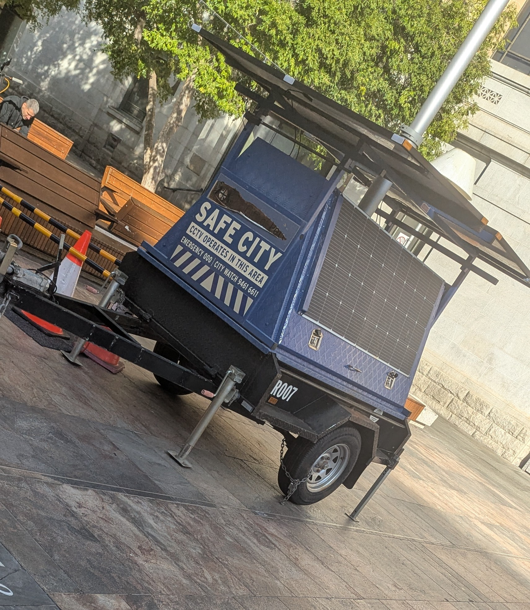
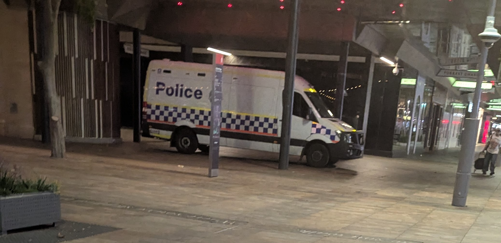
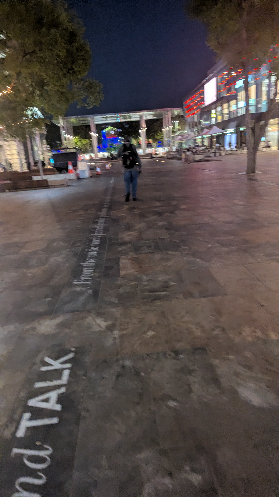
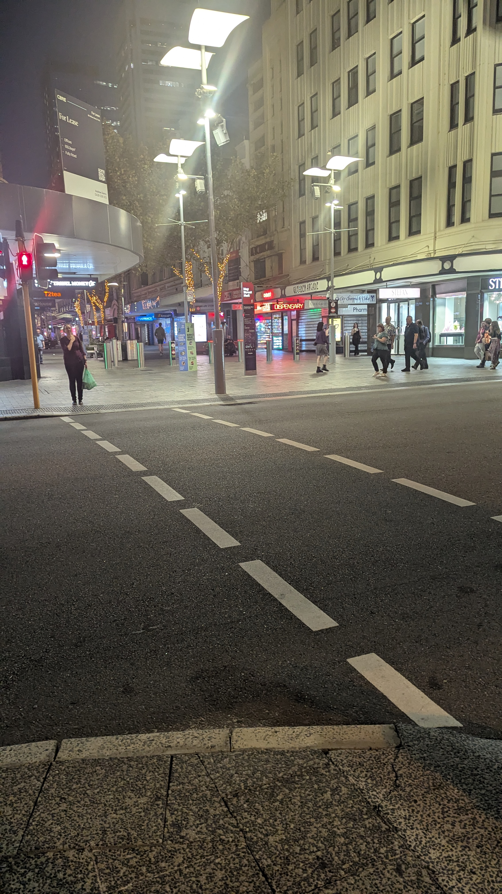

# Introduction
For this activity, I investigated security mechanisms used by the City of Perth. This is because the City of Perth has one of the largest foot traffic regions in Western Australia, so it is likely that their public spaces have several security mechanisms. They also appeared to thoroughly (and publicly) document their security implementations, which made them a perfect candidate to investigate for this task.

## [CCTV Monitoring (CityWatch)](https://perth.wa.gov.au/community/community-services-and-facilities/security-and-surveillance)
The City of Perth has a surveillance system consisting of over 800 fixed cameras located in areas like sidewalks which are monitored 24/7 by surveillance operators and WA Police. Access to these systems is restricted only to these two groups, which is a form of access control. On top of this, they (apparently) have some mobile cameras setup in areas identified to be high-risk (or "hotspot" areas). The footage recorded by these cameras is held for 30 days before it is overwritten, and access to footage is only released to individuals applying for reasons like court evidence. This system is intended to assist in the prevention of crimes against people or property, promoting a safer environment.

A (assumingly temporary) SafeWatch stand found in Forrest Place in Perth's CBD can be seen below. \

## [Patrol Officers](https://perth.wa.gov.au/community/community-services-and-facilities/security-and-surveillance/safe-city-review---implementation)
In addition to this surveillance system, they have people on foot at all times like rangers (of which there is apparently a team of 15), cleaners, and parking patrol who all work with the surveillance team in some capacity. The City of Perth make note that although there are these rangers and they do work closely with WA Police, they don't act as a replacement and only deal with certain incidents (like abandoned vehicles, footpath obstructions, permit checks, etc).

In addition to these patrol officers, WA Police are also frequently situated in areas with high foot traffic like the CBD. One of WAPOL's vans located near Forrest Place can be seen below. \

## [Crime Prevention through Environmental Design (CPTED)](https://perth.wa.gov.au/-/media/Project/COP/COP/COP/Documents-and-Forms/Live-and-Work/Documents/Community-Services-and-Facilities/Creating-Safer-Spaces.pdf)
This is an initiative used by the City of Perth in the planning and design of public spaces, with the aim of deterring anti-social behaviour and criminal activity. These guidelines detail how the principles of CPTED (surveillance, access control, and territoriality) can be used to facilitate this aim. Although it is primarily written as guidelines for private buildings, they are still applicable to public spaces within the City of Perth as well (who reportedly also use these guidelines). Suggestions for surveillance include enabling clear lines of sight around buildings, eliminating blind spots, making entrances to premises clearly visible, creating well-lit spaces etc. Suggestions for territoriality include using fences or walls to mark boundaries, separation between public and private spaces, using restricted access doors/gates to easily accessible areas, using boom gates at parking areas, etc. Suggestions for access control include utilising landscaping to indicate pedestrian routes, using lighting to encourage or discourage activities in certain spaces, using low walls for split fencing to mark out boundaries, having security at entrances to restricted areas, using electronic access control systems as necessary, etc. Some other suggestions for controlling behaviour are also indicated to stop anti-social behaviour, like image maintenance (i.e. keeping spaces well maintained), lighting control (i.e. ensuring spaces are well lit), signage (i.e. indicating what spaces should be used for), legibility (i.e. the design of the space is clear), etc.

Some of these principles, specifically the lighting and building guidelines, can be seen visibly in Perth CBD. The images below showcase these principles in greater detail (the first image became victim to Google's auto AI upscaling feature on images which I couldn't remove - however, the principles themselves are still visible in the image).

    
    

 

# References
The City of Perth. "Safety and surveillance". Accessed: Mar. 7, 2026. [Online]. Available: https://perth.wa.gov.au/community/community-services-and-facilities/security-and-surveillance

The City of Perth. "Safe City review implementation". Accessed: Mar. 7, 2026. [Online]. Available: https://perth.wa.gov.au/community/community-services-and-facilities/security-and-surveillance/safe-city-review---implementation

*Creating Safer Spaces: Design Guidelines to Reduce Crime and Antisocial Behaviour*, The City of Perth, 2019. [Online]. Available: https://perth.wa.gov.au/-/media/Project/COP/COP/COP/Documents-and-Forms/Live-and-Work/Documents/Community-Services-and-Facilities/Creating-Safer-Spaces.pdf

The City of Perth. "CCTV Surveillance Code of Practice". Accessed: Mar. 7, 2026. [Online]. Available: https://perth.wa.gov.au/-/media/Project/COP/COP/COP/Documents-and-Forms/Live-and-Work/Documents/Community-Services-and-Facilities/Code-of-Practice-Aug-23.pdf