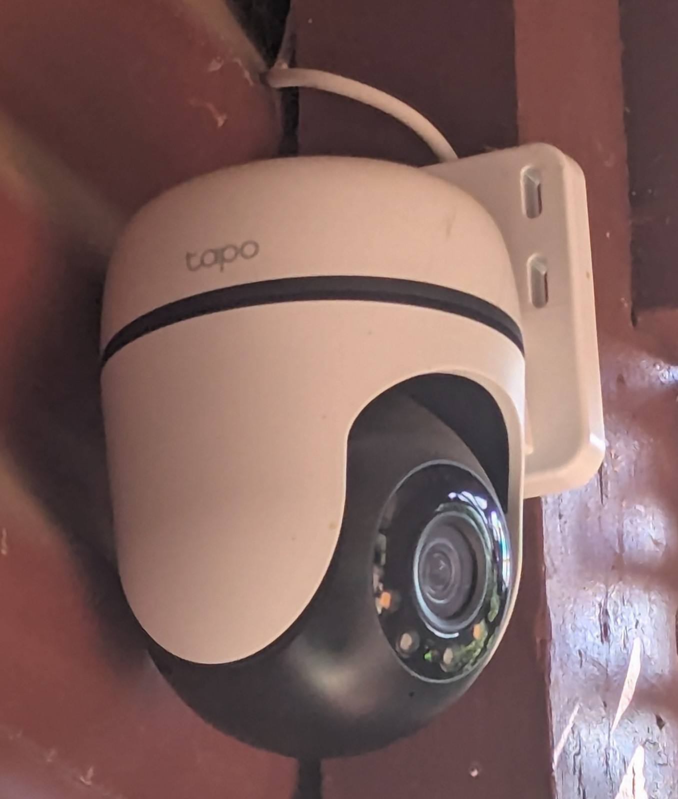
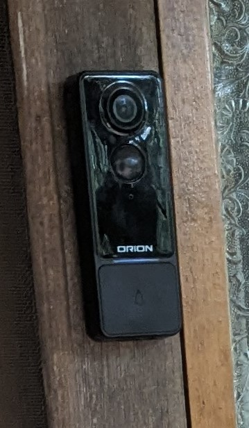
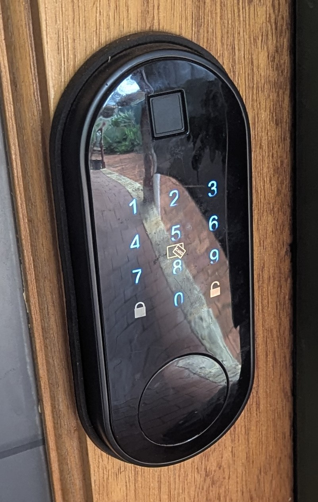

## Fences
Fences are probably the most common security device used in homes. There are fences on all four sides of the property, with only the front and back being "accessible". The front fence uses tall panels that extend the entire front, with an accessible gate (as is required by law). There are also several tall bushes and trees to prevent intruders from peering in through the fences from the footpaths.

## Wi-Fi Enabled Cameras and Doorbell
Throughout the property, both inside and outside, there are cameras installed. Each of these cameras is Wi-Fi enabled which allows them to be viewed on a mobile device from anywhere at any time. Some of these cameras installed also have motion detection, which flashes lights at any potential intruders to alert them to the presence of the cameras. \

The doorbell installed on the main door to the house is also Wi-Fi enabled, allowing for two-way communication between anyone at the front door from anywhere as well as allowing the person at the front door to be seen before it is opened (which could help against home intrusions, however unlikely that may be).

## Locks
Every single door and window in the house has some sort of lock. The windows use regular cylinder key locks, which prevents intrusion when no one is home. Although some of the doors use regular cylinder locks, there are also smart locks installed on two doors. These enable fingerprints (biometrics), NFC keycards, or a PIN code to be used to enter the house. \

## Motion Sensor Lighting
In addition to the cameras installed which have motion-activated lighting, there are various solar-powered lights around which also activate if they detect motion. This, again, will alert intruders that they can be seen if they were to make their way onto the property.