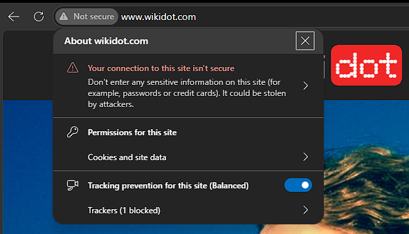
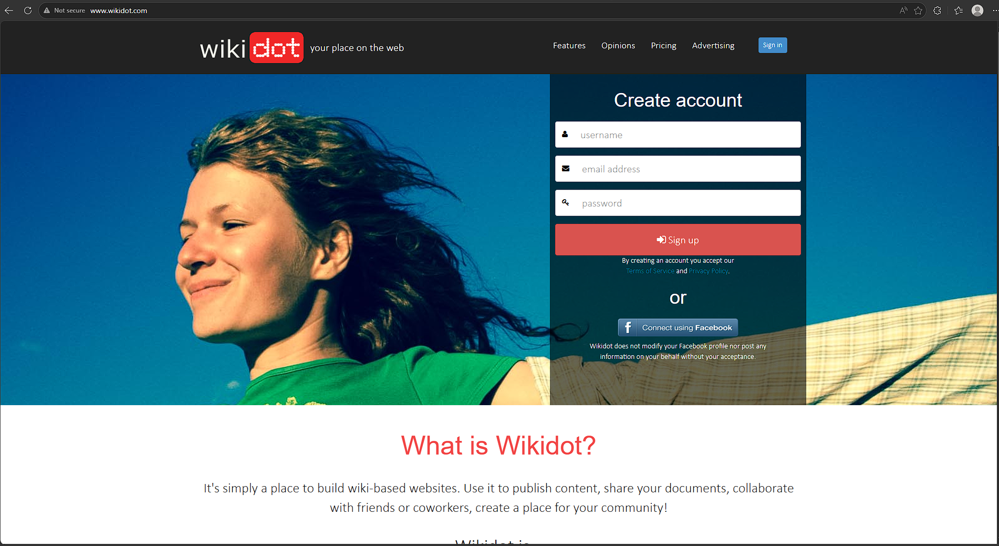

[Wikidot](https://www.wikidot.com), a website which hosts various wiki-based websites, does not enforce HTTPS when visiting. While it does have a HTTPS version of the website, there is also an accessible HTTP version of the website publicly accessible.

 In fact, according to their pricing guide, they still charge to allow wikis hosted on the website to use SSL (and therefore have HTTPS). As HTTP connections can be made on the account creation and account login pages, any information entered (including what is likely to be plaintext credentials) is vulnerable to man-in-the-middle attacks as it is sent over the network.

 
 
 Although losing credentials to a wiki website is pretty low risk, people often use the same passwords across multiple websites (despite the security implications of doing this) so the overall risk is extremely high. This can be fixed by enforcing HTTPS across all pages, particularly the login/signup pages and any associated endpoints. SSL can be added to websites for free with services like Let's Encrypt, so this would be an inexpensive and easy adjustment to make which would enhance the security of the website. Enabling HSTS, which enforces HTTPS connections, would also increase the security of the website.