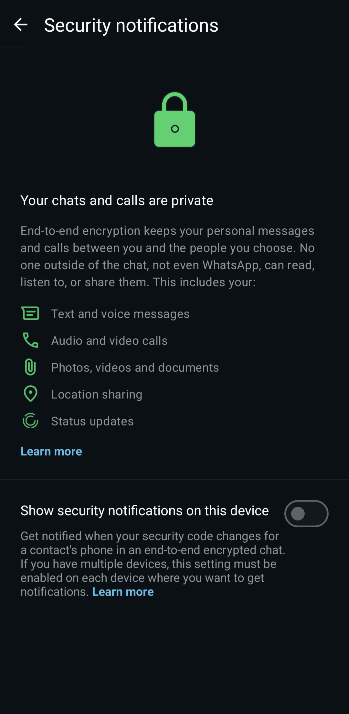

# End-to-End Encryption in WhatsApp
In online environments, cryptography is often applied to protect information from being intercepted and exposed to any bad actors who may be listening for such information. Although many online environments rely on network protocols to ensure the secure transmission of data, some implement their own encryption standard on top of these protocols. WhatsApp, the social media messaging platform from Meta, is one of these applications. \

WhatsApp uses end-to-end encryption for all communication sent on its platform (including messages, voice calls, video calls, message history, and app state). The encryption system is based on The Signal Protocol developed by Open Whisper Systems (now known as the Signal Technology Foundation), which is used in many other similar apps like the Signal Technology Foundation's own [Signal communication platform](https://signal.org/). According to WhatsApp's documentation, it uses three types of cryptographic keys - the public keys, the session keys, and other keys. The public keys are generated at install time, and include the "Identity Key" pair (which is a long-term CURVE25519 key pair), the "Signed Pre Key" (which is a medium-term Curve25519 key pair signed by the "Identity Key" and rotated periodically), and the "One-Time Pre Keys" (a queue of Curve25519 key pairs for one time use which are replenished as they are needed). The session keys are used to encrypt messages, and include the "Root Key" (a 32-byte value used to create "Chain Key"s), the "Chain Key" (a 32-byte value used to create "Message Key"s), and the "Message Key" (an 80-byte value used to encrypt message contents, where 32 bytes are used for an AES-256 key, 32 bytes for a HMAC-SHA256 key, and 16 bytes for an initialisation vector). The final key type is the "Linking Secret Key", which is a 32-byte value that is generated on a companion device (any device using the same WhatsApp account which did not create the account) and passed to the primary device (the device which created the account). This means that each device, even using the same WhatsApp account, has different key pairs for encryption/decryption.

When a WhatsApp account is created, the client transmits the public "Identity Key", public "Signed Pre Key", and a batch of public "One-Time Pre Keys" to the server, which stores these keys and associates them with the client. The corresponding private keys are maintained on-device, and are not transferred anywhere else (as doing so would compromise any communication if intercepted). When communication begins, the sender's client establishes a pairwise encrypted session with each of the receiver's devices (and once established do not have to be re-established unless the session state is lost which WhatsApp claims can only be caused by things like app reinstalls and device changes). Sessions are established by the sender requesting the public "Identity Key", public "Signed Pre Key", and a single public "One-Time Pre Key" for each device of the receiver (since each companion device has a different set of keys, and doing this allows each device owned by the receiver to read the messages) as well as each of the sender's devices (since all of their devices need to be able to read the messages as well). The server returns these requested values (3 keys per device communicating with), and the "One-Time Pre Key" is removed from the server (as they are only used once). After verifying the each device identity (to confirm they are indeed owned by the receiver), the sender establishes an encrypted session with each individual device. 

Clients can then exchange messages with each other, which are protected with a "Message Key". To transmit a single message to *n* devices, the WhatsApp client sends it individually to those *n* devices using the pairwise encrypted session previously established with those devices. Group messages in WhatsApp use a slightly different communication method. When sending a message to a group for the first time, a "Sender Key" is generated and distributed to every member (and their companion devices) using this same pairwise encryption sessions. The contents of messages sent to the group is encrypted using this "Sender Key". Whenever a group member leaves, the "Sender Key" is cleared and all participants generate a new key and re-established sessions.

 

# References
WhatsApp. "About end-to-end encryption". Accessed: Mar. 11, 2026. [Online]. Available: https://faq.whatsapp.com/820124435853543

WhatsApp. *WhatsApp Encryption Overview Version 7*. (2023). Accessed: Mar. 11, 2026. [Online]. Available: https://ftp.kr-labs.com.ua/books/384251896_820338303082371_8514785982310046047_n.pdf