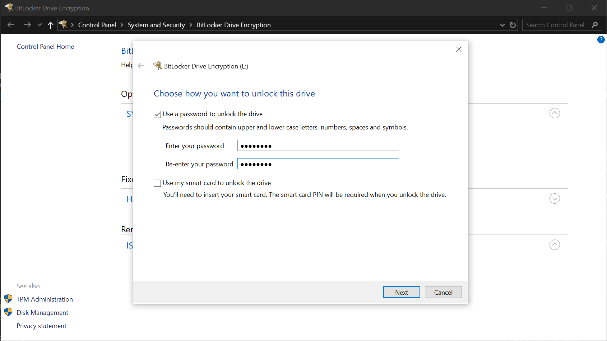
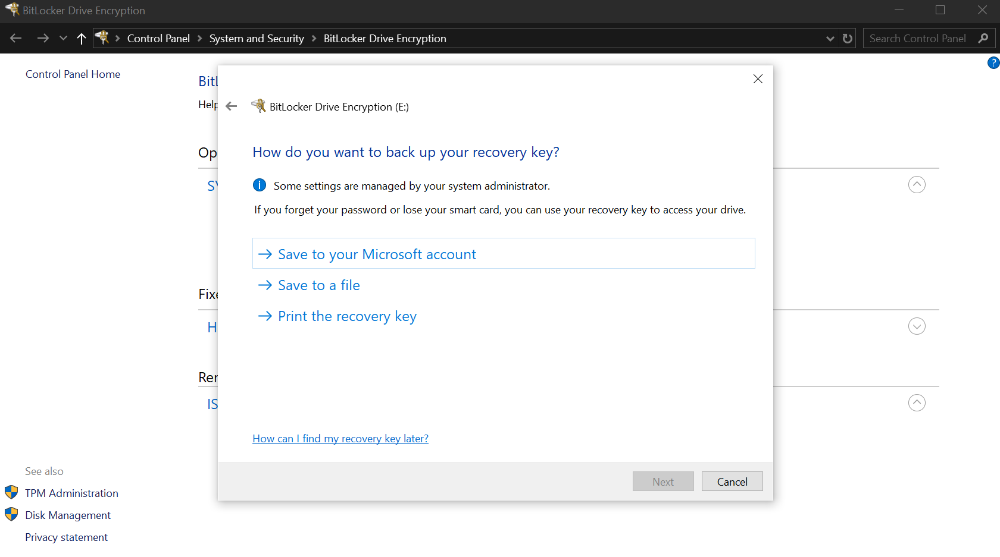
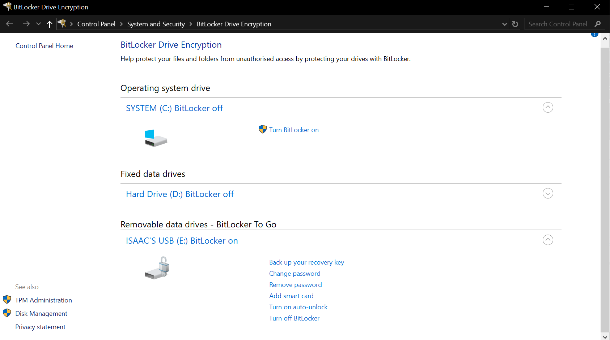

# Drive Encryption
On modern operating systems, there is often some form of drive encryption to protect the data stored on it from being read without the master key. These are offline cryptographic implementations because they do not require any network access to perform, and protect locally stored data rather than transmitted data (like would be the case with HTTPS, for example).

On Windows, this feature is known as BitLocker Drive Encryption (or more simply, BitLocker). It is only available on certain editions of Windows - specifically the Pro, Enterprise and Education editions of Windows 7, 8, 10, and 11. Contrary to its name, it can be used to encrypt specific volume(s) which can be part of a drive, a full drive, or a collection of drives. If it is enabled on the volume containing the operating system components, it must be split into two partitions - one to hold the (unencrypted) bootloader and BitLocker files (as encrypting them would make booting impossible) and one to hold the operating system files (i.e. the rest of the volume). It uses the Advanced Encryption Standard (AES), with the ability to use key lengths of 128 bits (i.e. AES-128, which is the default setting) or 256 bits (i.e. AES-256). Microsoft's documentation states that BitLocker works best when used with a Trusted Platform Module (TPM) chip, which is common on modern motherboards in both desktops and laptops, as it works to ensure that a device hasn't been tampered with while offline. BitLocker also supports additional security measures (though TPM alone can be used) in the form of a preboot screen that asks the user for a PIN, password, or physical startup key (which is a removable storage drive that stores a verification file) before the system will continue booting. Although using TPM is the preferred method, if it is not active or not available then the only security measures that can be used are a password or physical startup key. In the case that the startup key is forgotten, BitLocker will enter a recovery mode allowing a recovery password (consisting of 48 digits split into 8 groups) or a recovery key on a removable storage drive to be used which unlocks the data on the volume.

For Windows devices which do not support BitLocker (mostly devices using the Home editions of Windows), Device Encryption is available. This uses similar mechanisms to BitLocker (with official documentation even calling it BitLocker encryption), and is enabled by default on supported hardware. When Device Encryption is enabled, the recovery key becomes attached to the Microsoft account on that device rather than having the ability to save it elsewhere. Consequently, this means any devices using local user accounts cannot use it. Unfortunately documentation of Device Encryption is very scarce, but in general it seems to essentially be a more limited version of BitLocker with wider availability.

For devices running MacOS, there is a similar feature known as FileVault. Similarly to BitLocker, FileVault also uses AES-XTS encryption with support for both 128 bit keys and 256 bit keys. Macs with Apple silicon (i.e. M-series Macs) or an Apple T2 Security Chip have this turned on automatically, but other Macs can also utilise it by manually turning it on. This must be done by an administrator account, and it will encrypt all users' information (if multiple users use the same Mac) which can be unlocked using their login password (unless they don't also have FileVault turned on, in which case there's a weirdly complicated process to login). In the event that the login password is forgotten, there are two recovery options - "giving" the recovery key to your iCloud account, or if that option is not available creating a recovery key (similar to BitLocker's recovery password).

Of these options, the most accessible to me was BitLocker. As a test, I used it on an old external USB flashdrive that I had laying around. To begin the process, the first thing that it asked me was to create a password to unlock the drive's contents.

This password would allow the drive's contents to be decrypted. I was then asked how I wanted to backup the encryption key.

I chose to save it to a file, which has also been provided (and although this is not typically good security practice, this particular drive's contents are empty currently). This started the encryption process, and all the files which were on the drive were completely encrypted (unless you had the master key or recovery code). This was also reflected in the dashboard for BitLocker, which gave me several options to handle my newly encrypted drive.

 

# References
Microsoft. "BitLocker Drive Encryption". Accessed: Mar. 10, 2026. [Online]. Available: https://support.microsoft.com/en-au/windows/bitlocker-drive-encryption-76b92ac9-1040-48d6-9f5f-d14b3c5fa178

Microsoft. "BitLocker FAQ". Accessed: Mar. 10, 2026. [Online]. Available: https://learn.microsoft.com/en-gb/windows/security/operating-system-security/data-protection/bitlocker/faq

Microsoft. "BitLocker overview". Accessed: Mar. 10, 2026. [Online]. Available: https://learn.microsoft.com/en-gb/windows/security/operating-system-security/data-protection/bitlocker/

Microsoft. "Drive Encryption in Windows". Accessed: Mar. 10, 2026. [Online]. Available: https://support.microsoft.com/en-au/windows/device-encryption-in-windows-cf7e2b6f-3e70-4882-9532-18633605b7df

Apple Inc. "Protect data on your Mac with FileVault". Accessed: Mar. 10, 2026. [Online]. Available: https://support.apple.com/en-au/guide/mac-help/mh11785/mac

Apple Inc. "Intro to FileVault". Accessed: Mar. 10, 2026. [Online]. Available: https://support.apple.com/en-au/guide/deployment/dep82064ec40/web

Apple Inc. "How does FileVault work on a Mac?". Accessed: Mar. 10, 2026. Available: https://support.apple.com/en-au/guide/mac-help/flvlt001/mac