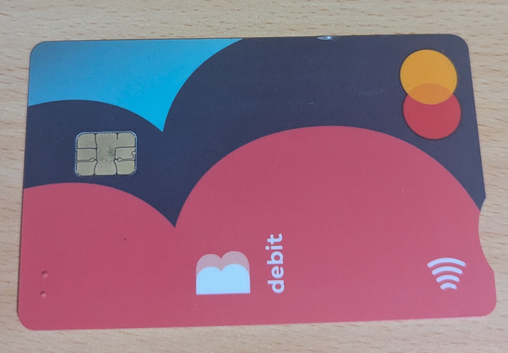

# The EMV Chip
To complete this activity, I first had to consider which IoT devices even use cryptography. My first immediate thought was NFC-enabled smart cards, like what student cards and SmartRiders are. This led me down the rabbit-hole of banking cards, which use an interesting cryptographic system to validate purchases. 

Bank cards implement cryptography with embedded circuits containing an EMV chip. Unlike the magnetic stripe on the back of cards which sends real unencrypted data to the reader, the EMV chip doesn't send any sensitive information (like card numbers) as plaintext. Instead, the process begins with the reader reading the chip's data and runs a series of cryptographic checks to validate the card. Then it generates a unique code (which cannot be used more than once or easily faked) called a cryptogram for every transaction and sends that code to the reader. If the transaction is approved, it sends an authorisation code to the card reader which completes the transaction. This process takes quite a bit longer than the conventional method of the magnetic stripe because of the cryptographic checks it performs (where encryption and decryption take time) but it is also significantly safer than the magnetic stripe (and isn't vulnerable to things like card skimming). This method is slowly being replaced by newer, more advanced methods like NFC, which use smartphones to authenticate transactions which allows for much faster transaction processing (with possibly higher security). The following is a card which uses an EMV chip to process transactions: \

According to the most recent specification published by EMVCo., the information can be encrypted using either triple DES (DES3) or AES. If DES is used, a CBC MAC is used for the generation and validation of authentication cryptograms with the CBC mode of operation used in session key derivation. If AES is used, only AES-128 and AES-256 is allowed (though AES-192 can be used, it just pads to AES-256). To encrypt information, the CBC mode of operation is used with AES based CMAC construction used for authenticity services. This is also standardised by ISO/IEC 7816, allowing cards from different banks to be read in the same way by card readers.

 

# References
Stripe, LLC. "What are EMV chip cards? How EMV works and why it's so secure". Accessed: Mar. 6, 2026. [Online]. Available: https://stripe.com/au/resources/more/what-are-emv-chip-cards

ACI Worldwide. "EMV Technology and Transactions, Explained". Accessed: Mar. 6, 2026. [Online]. Available: https://www.aciworldwide.com/emv-payments-transactions

*EMV Card Personalisation Specification*, Version 2.0, EMVCo., August 2021. [Online]. Available: https://www.emvco.com/specifications/emv-card-personalisation-specification/

*Identification cards — Integrated circuit cards — Part 8: Commands and mechanisms for security operations*, ISO/IEC 7816-8:2021, August 2021. [Online]. Available: https://www.iso.org/obp/ui/#iso:std:iso-iec:7816:-8:ed-5:v1:en