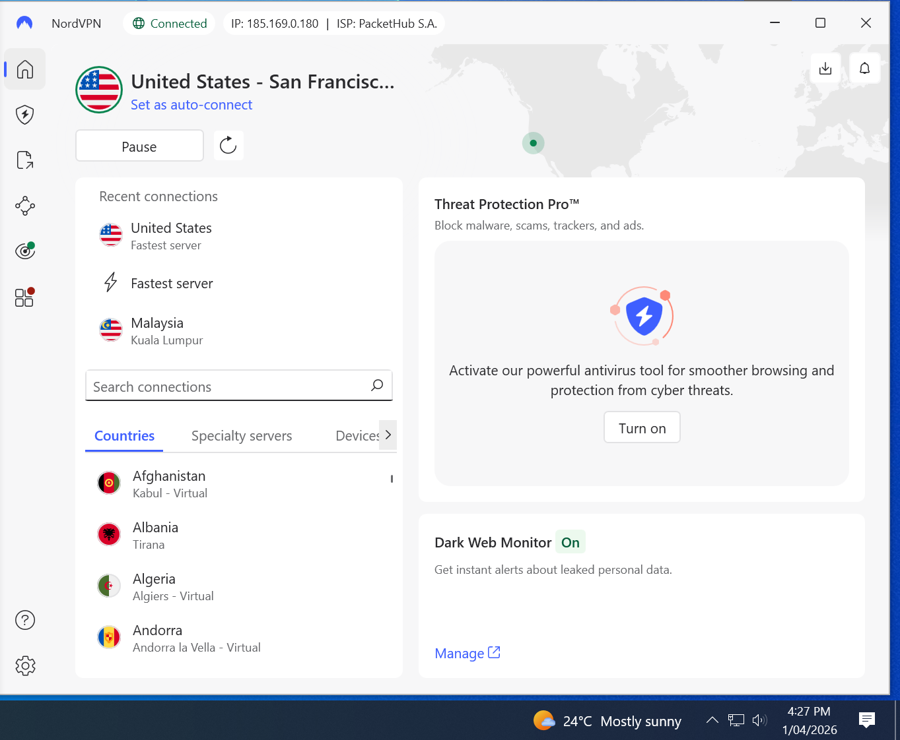
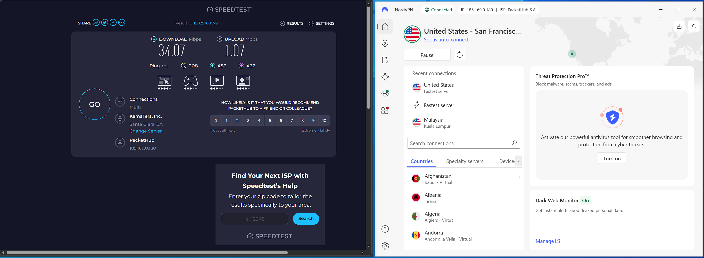
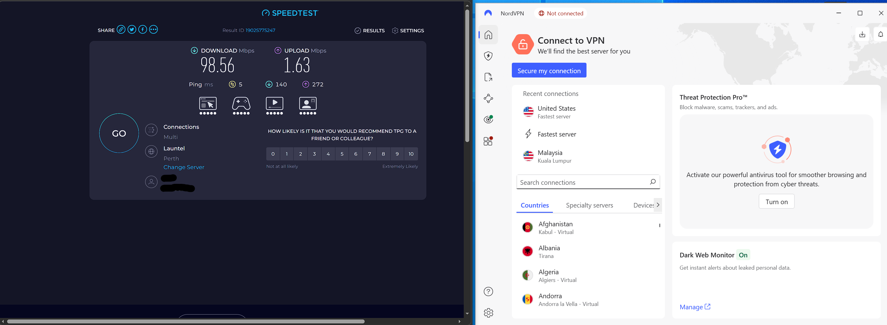

# Virtual Private Networks
Virtual Private Networks (or VPNs) establish a digital connection between your device and a remote server (usually a VPN provider). This creates an encrypted "tunnel" between your device and the remote server which routes all internet traffic through it. This has the effect of making it appear as if your traffic is coming from the remote server's location, which masks your IP address (and your location) and can allow you to sidestep geographical blocks/restrictions. This means that your online activity has reduced visibility to anyone who may intercept or track it, like your ISP or other unauthorised third parties (like advertisers). Although your online activity could be read by the VPN provider, any reputable provider has a no-logging policy with third party audits to ensure that your activity isn't stored. These are particularly useful when using public Wi-Fi (as anyone intercepting your requests won't be able to read it) or when trying to securely connect to a private network (like a LAN). Even outside of these circumstances, anyone can use a VPN to make their online activity more secure with greater privacy.

There are a few different types of VPNs. Remote access VPNs are one of the most common types of VPN, and they allow devices to remotely connect to a private network. They are commonly used to (temporarily) allow off-site employees access to their employer's resources. This is often accomplished through authenticating any connections made using the VPN, authorising the user/device to access internal files. A site-to-site VPN connects different LANs together into one unified system. They are commonly used by large organisations which operate in several locations to link their internal networks together securely, and are permanently connected once set up. This allows resources to be shared between different LANs. The final type is consumer VPNs. Unlike the other two types, this is primarily used by individuals who want to utilise the advantages of a VPN (such as anonymising their online activity). These are what most people think of when discussing VPNs, and they operate by routing your outgoing traffic from your device to a remote server.

VPNs work with a simple process with only a few steps. Once your device is connected to the VPN, your network traffic is encrypted using an encryption key (which your device has). This (encrypted) data is then sent through the tunnel created between your device and the VPN server. Once it reaches the VPN server, it is decrypted using the decryption key (which the VPN server has). The VPN server then forwards your request to its actual destination, making it seem like the VPN server made the request rather than your device which masks your identity. Once the destination server processes the request, the response is sent back to the VPN server and the reverse of this process is executed.

There are a few different protocols used by VPNs which transfer data between your device and the remote server in different ways. These include:
- Internet Protocol Security (IPSec)
- OpenVPN
- WireGuard
- Layer 2 Tunneling Protocol (L2TP)
- Secure Socket Tunneling Protocol (SSTP)
- Point-to-Point Tunneling Protocol (PPTP)

The following shows the connection process of NordVPN on my device. \

The following also show the (expected) difference in speeds and latency while using the VPN. \
 \

 

# References
Microsoft. "What is a VPN?". Accessed: Mar. 18, 2026. [Online]. Available: https://azure.microsoft.com/en-au/resources/cloud-computing-dictionary/what-is-vpn

Nord Security. "No-logs policy". Accessed: Mar. 18, 2026. [Online]. Available: https://nordvpn.com/features/no-log-vpn/

Cisco Systems, Inc. "What is a virtual private network (VPN)?". Accessed: Mar. 18, 2026. [Online]. Available: https://www.cisco.com/site/us/en/learn/topics/security/what-is-a-virtual-private-network-vpn.html

Surfshark. "What is a VPN? A beginner's guide". Accessed: Mar. 18, 2026. [Online]. Available: https://surfshark.com/learn/what-is-vpn

Nord Security. "Types of VPNs and protocols". Accessed: Mar. 18, 2026. [Online]. Available: https://nordlayer.com/learn/vpn/types-and-protocols/