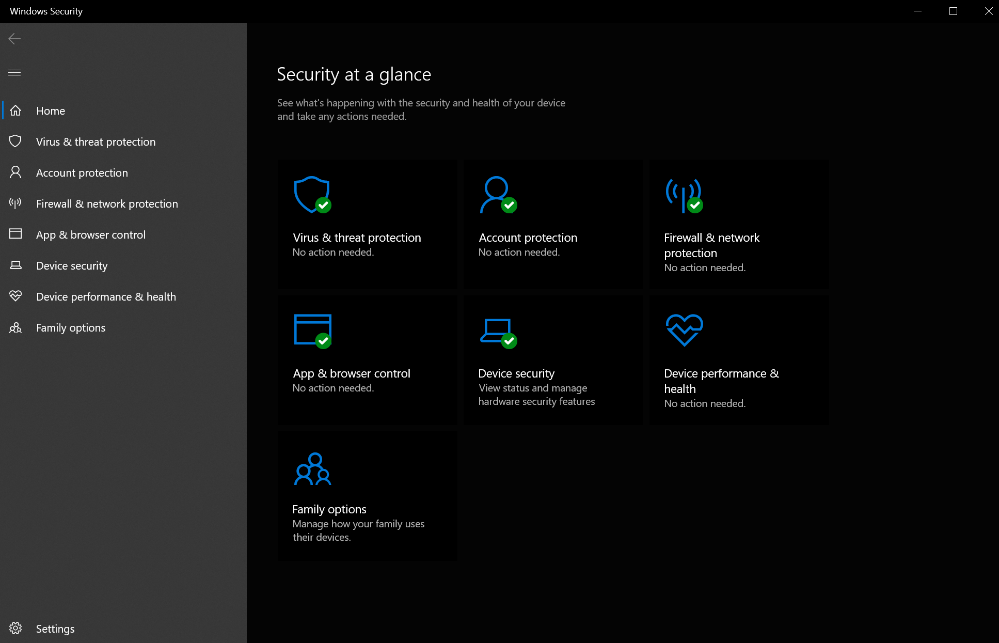
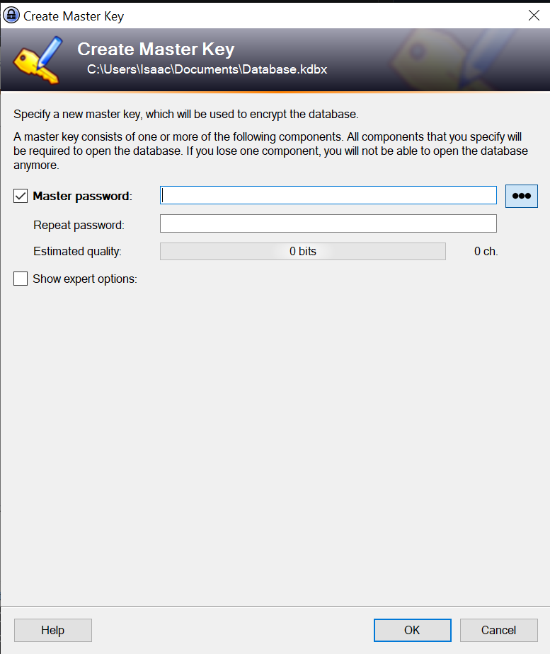
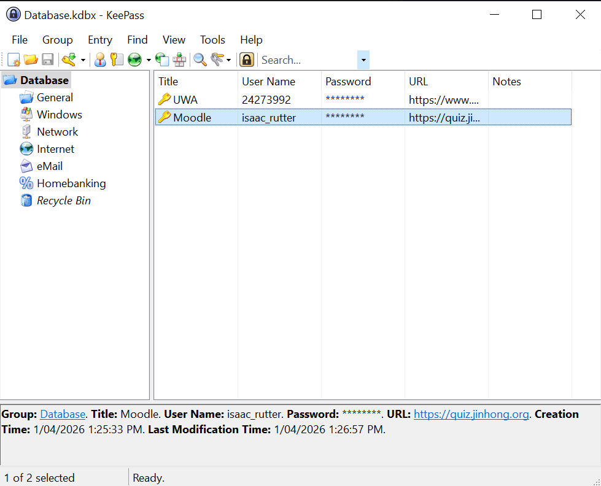
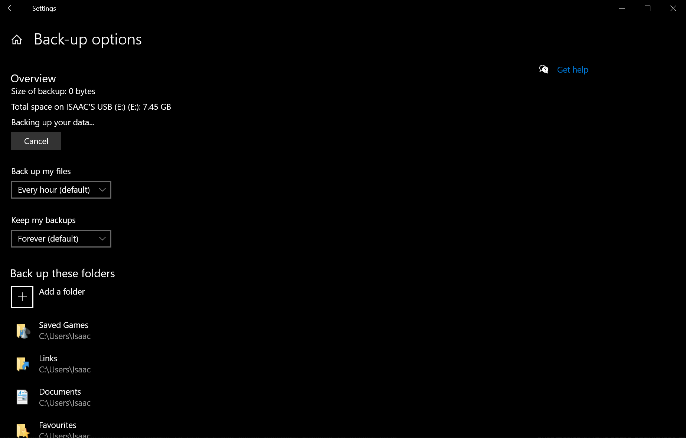
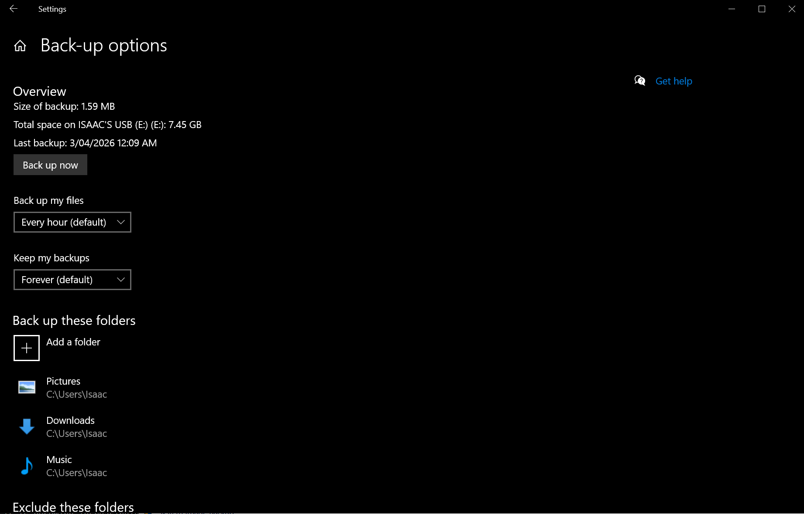
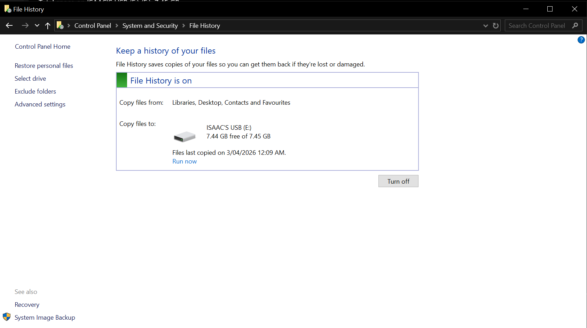
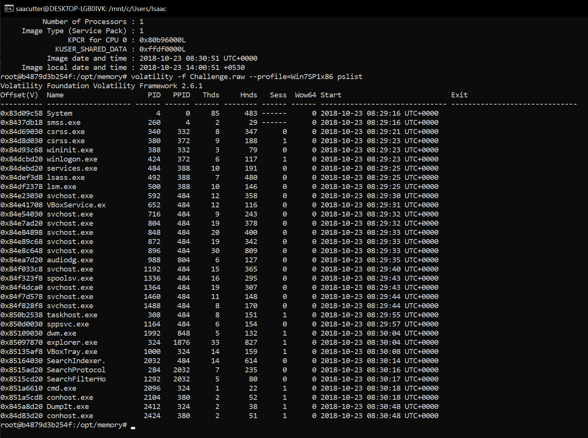

# Introduction
For this activity, I researched some different offline security tools that are commonly used. The tools I chose are all broad categories of tools rather than specific ones because specific tools can always change (e.g. Adobe software going from local/offline software to more cloud-based), while tool categories generally do not. I have justified each of these tools as offline security tools for the following reasons:
- Antivirus Software
    - Antiviruses are offline tools because they generally run locally on devices rather than through the cloud
    - Antiviruses are security tools because they identify potential threats to devices
- Password Managers
    - Password managers are offline tools because some (though not many anymore) run locally without passwords being stored in the cloud. However, even with the ones that do operate in the cloud, they encrypt data locally so they could be argued to still be offline tools
    - Password managers are security tools because they allow people to generate unique passwords for each of their accounts and store them securely, which is recommended by many security organisations (like the ACSC)
- Offline Backups
    - I don't think it needs to be explained why this is an offline tool
    - Backups are security tools because they allow data to be recovered in the event that it is made inaccessible on a main device by an attacker
- Disk Encryption
    - Disk encryption is an offline tool because it encrypts data locally with no network access required
    - Disk encryption is a security tool because it renders data unusable to any unauthorised access
- Memory Forensics Tools
    - These tools are offline because they don't require any network connectivity to operate and extract data stored on local machines
    - These tools are security tools because they analyse potential threats which may be on a system

## Antivirus Software
Antivirus software is a piece of software which runs locally on computers as a background process which scans files on your computer to identify patterns to identify the presence of any malicious software (i.e. malware). They are designed to monitor, detect, prevent, and eliminate malware before they damage your devices. They perform scans on your devices, which can be done automatically (scanning specific files on a set schedule) or manually (which will often do a more "complete" scan of your files). Most antiviruses work by identifying patterns and seeing if they are similar to signatures of known malware. However, more advanced techniques are starting to be used like machine learning algorithms to identify potential malware in real-time. If an infected file is found, it will often try to remove the malware automatically (but some antiviruses may ask the user first).

Most modern devices come with an antivirus built-in to the operating system. Windows comes pre-installed with Windows Defender, MacOS comes pre-installed with Notarisation and XProtect, and Android comes pre-installed with Google Play Protect. Some devices may additionally come pre-installed with a free trial for a third-party antivirus, like Acer laptops which come pre-installed with [McAfee](https://www.acer.com/au-en/mcafee). In addition to these, users can install (and pay for) their own third-party antivirus software to keep their devices protected against malware.

Windows Defender is a common antivirus that comes pre-installed on all Windows devices. The security dashboard as it appears on my desktop can be seen below. \

## Password Managers
Password managers are a piece of software which help create, manage, and store your passwords. Although this is often done locally on your own hardware, it is becoming increasingly more common to use a cloud-based password manager to access your passwords across devices. Password managers work by having a "master password" (which can key any sort of login depending on the provider), and this is the only piece of information needed to access your stored passwords. Usually, the passwords being stored are encrypted when they are added to the "vault" (the storage location of your passwords). This prevents attackers who may have gained access to your device from accessing these passwords, even if they manage to find where they are stored. These passwords can then be decrypted using some sort of secret (usually involving the master password) allowing you to see your passwords.

In addition to storing passwords, password managers also often have password generation features. This means that different passwords can be used for each account, which is useful to prevent leaked passwords being used to access all of your accounts. These generated passwords can be safely stored in the password manager, with only the master password being necessary to access them (so users don't have to remember each and every password). Although this doesn't prevent passwords from being used by malicious actors, it reduces the impact of the hack.

There are various different password managers, and some which can run entirely offline include [KeePass](https://keepass.info/) and [Buttercup](https://github.com/buttercup). There are also some options which are pseudo-offline, like [ProtonPass](https://proton.me/support/pass-offline-access) (which only requires an internet connection on initial sign in) and [self-hosted Bitwarden](https://bitwarden.com/help/self-host-bitwarden/) which allows users to store their passwords on their own servers instead of Bitwarden's.

In order to investigate the functionalities of these offline password managers, I looked at Keepass. It has the option to have several databases, which are stored as local files on the machine and protected by the master key (which is chosen at database creation time). Once the database is created, password entries can be easily added to the database.

    
    

## Offline Backups
Backups are digital copies of important data that can be used to restore data if it is ever lost. Offline backups, as the name suggests, are data backups which are stored locally off any networks. This means that if your data was to ever be lost through, for example, a malware attack on your device, it can be restored using this backup. The data that is considered important will vary by users, and can range from small things like photos and documents to large things like databases and images of your device's storage (including the operating system, applications, and all other data stored on the device).

There are various advantages to maintaining an offline backup of important data. This backup should be stored offsite to maximise the chances of recovering data. This means that if the building where your devices are is impacted by some incident (e.g. fire, earthquake, theft, etc), the data can still be recovered. Maintaining a regular backup of your data will minimise the data loss from such an incident, so they should be done frequently. This can be done automatically on a scheduled routine, or manually whenever big changes have been made to your data.

Windows, by default, has a feature allowing backups of specific files to be made to another drive. After choosing some folders to backup to an external drive and how often I wanted backups to occur (using teh default of every hour), it started creating copies of the data and writing them to the drive.

Once it had finished, it declared the size of the backup and stated when the last backup was.

This same data was also reflected in another control panel for offline backups, known as File History.

## Disk Encryption
Disk encryption is an essential part of information security. It keeps your data secure in the event that your device is lost or stolen, preventing unauthorised access to your data. There are a few different types of disk encryption, including Full Disk Encryption, File-Level Encryption, Hardware-Based Encryption, Software-Based Encryption, Virtual Disk Encryption, and Database Encryption. Full-Disk Encryption, as the name suggests, encrypts the entire volume/drive (including operating system files). This is common to protect data at rest, as it prevents unauthorised access to the data even with physical access to the storage drive. File-Level Encryption only encrypts individual files (including directories), but generally has less impact on system performance due to it not needing to decrypt every file whenever they are required which has a lot of overhead.

Most modern operating systems have some form of disk encryption mechanism available to use. Windows has BitLocker, MacOS has FileVault, and many Linux distributions come with the Linux Unified Key Setup (LUKS). These all encrypt data slightly differently, but the main objective of protecting your data is the same across all of them.

## Memory Forensics Tools
Memory forensics is the process of capturing an image of the RAM of a device which contains data like currently running processes, open files, network connections, and system/user configurations at the time of the image. This image can then be inspected, identifying if there is evidence of any malicious activity within the image. The RAM is often imaged instead of the main storage drive because the RAM is significantly smaller, so capturing an image will be much quicker and easier to analyse. Additionally, there is some malware which can be executed directly from the memory without being written to the disk so memory forensics can be used to determine the impact it had on the system.

This is an important part of incident response and threat analysis which aims to uncover evidence of malware that leave footprints in a system's RAM. There are some challenges to using the RAM because it is volatile. It is constantly changing and only exists while the system is powered on, making capturing images difficult sometimes. This volatility also poses issues because it makes it difficult to preserve data in its original state. This also impacts the tools used to extract the memory, which can accidentally modify the memory contents.

Some popular memory forensics tools include [Volatility](https://volatilityfoundation.org/) which has support for several operating systems, and the [Linux Memory Extractor](https://github.com/jtsylve/LiME) (or LiME) which is only available for Linux. Using the instructions from CITS1003 lab 8, I was able to get voltaility to analyse a memory dump that was available on the Docker container to view its contents. \

 

# References
United States Department of Homeland Security. "Understanding Anti-Virus Software". Accessed: Mar. 24, 2026. [Online]. Available: https://www.cisa.gov/news-events/news/understanding-anti-virus-software

Fortinet, Inc. "What Is Antivirus Protection". Accessed: Mar. 24, 2026. [Online]. Available: https://www.fortinet.com/resources/cyberglossary/antivirus-protection

Australian Signals Directorate. "Antivirus software". Accessed: Mar. 24, 2026. [Online]. Available: https://www.cyber.gov.au/protect-yourself/securing-your-devices/how-secure-your-device/antivirus-software

Apple Inc. "Protecting against malware in MacOS". Accessed: Mar. 24, 2026. [Online]. Available: https://support.apple.com/en-au/guide/security/sec469d47bd8/web

Australian Signals Directorate. "Password managers". Accessed: Mar. 24, 2026. [Online]. Available: https://www.cyber.gov.au/protect-yourself/securing-your-accounts/password-managers

United Kingdom National Cyber Security Centre. "Top tips for staying secure online". Accessed: Mar. 24, 2026. [Online]. Available: https://www.ncsc.gov.uk/collection/top-tips-for-staying-secure-online/password-managers

Australian Signals Directorate. "How to back up your files and devices". Accessed: Mar. 24, 2026. [Online]. Available: https://www.cyber.gov.au/protect-yourself/securing-your-devices/how-back-up-your-files-and-devices

J. Lyne. "Offline backups in an online world". United Kingdom National Cyber Security Centre. Accessed: Mar. 24, 2026. [Online]. Available: https://www.ncsc.gov.uk/blog-post/offline-backups-in-an-online-world

University of Oxford. "Disk encryption". Accessed: Mar. 24, 2026. [Online]. Available: https://www.infosec.ox.ac.uk/encryption

J. Lui, D. Vergnaud, and X. Ma, "Disk Encryption". Accessed: Mar. 24, 2026. [Online]. Available: https://www.sciencedirect.com/topics/computer-science/disk-encryption

L. Pekkarinen. "Hard Drive and Full Disk Encryption: What, Why, and How?". GoTo. Accessed: Mar. 24, 2026. [Online]. Available: https://www.miradore.com/blog/hard-drive-encryption-full-disk-encryption/

N. Fox. "Memory Forensics for Incident Response". Varonis. Accessed: Mar. 24, 2026. [Online]. Available: https://www.varonis.com/blog/memory-forensics

R. Robinson. "Memory Analysis 101: Understanding Memory Threats and Forensic Tools". intezer.com. [Online]. Available: https://intezer.com/blog/memory-analysis-forensic-tools/