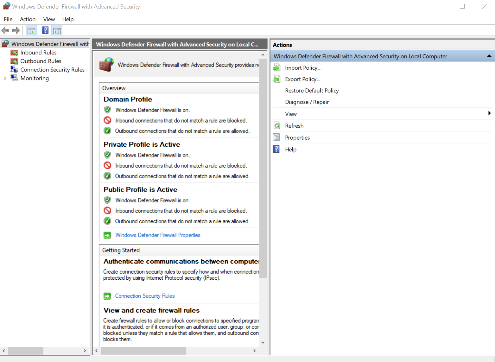
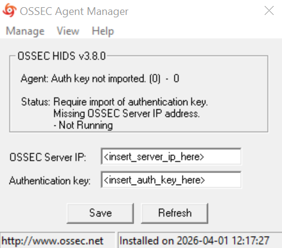
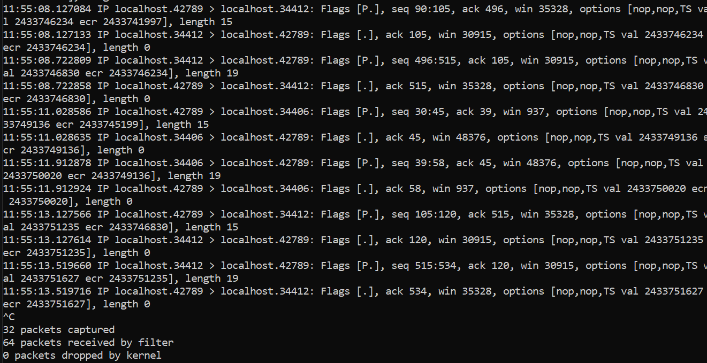
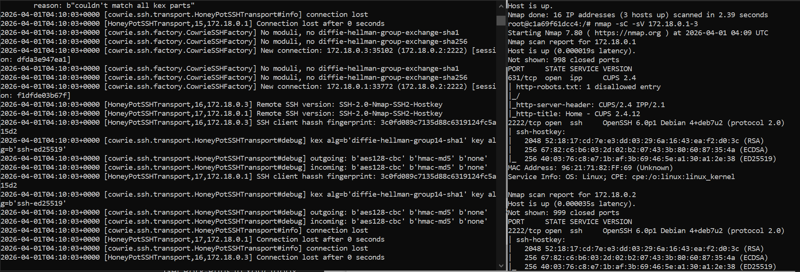
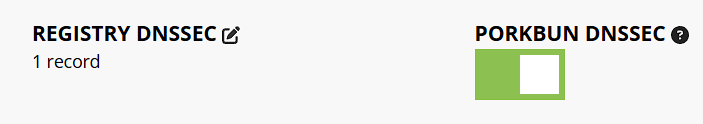
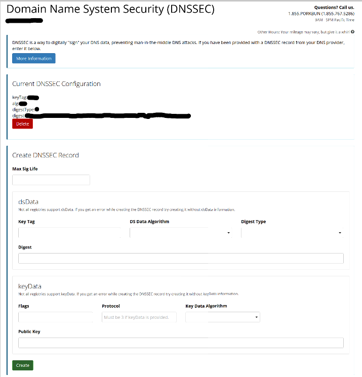

# Introduction

## Firewalls
Firewalls are a security mechanism which provide protection against cyber attacks by monitoring network traffic based on a set of security rules.

There are two types of firewall - hardware firewalls and software firewalls. Hardware firewalls are physical devices which are positioned between your devices and the internet. They are often part of your home router, and are useful to protect multiple devices on your network. Software firewalls are firewalls which are run separately on devices. Although they can be part of the operating system, third-party options also exist. They allow the network behaviour of individual applications to be controlled, but because they run locally on the device this can hinder its ability to detect malicious activity.

The below shows Windows Firewall running on my desktop. \

## Intrusion Detection and Prevention Systems
Intrusion detection systems (IDS) are security tools which monitor network traffic and devices for suspicious and/or malicious activity (but cannot take action automatically, hence they only listen). Unlike firewalls, these only signal an alert when a threat is detected but don't protect the endpoint or network. They can be implemented as both software that is installed on endpoints (like each client device on the network) or hardware which is connected to the network (so that the whole network is being monitored), but both solutions otherwise act identically. They have a separate component called a terminal access point (or TAP) which copies the network traffic and analyses the copy so that it doesn't impact the network performance. IDSs can use either signature-based or anomaly-based threat detection methods. Signature-based detection analyses inbound network packets for unique characteristics or specific patterns that are associated with a known attack signatures. For these systems to be effective, they must maintain a regularly updated signature database (though this does not help detect against brand new attacks with no known attack signature). Anomaly-based detection uses machine learning to create a "baseline" model of normal network activity for the network it is attached to, which is constantly learning over time. Any network activity is then monitored, and the model will flag deviations from what it has found to be normal at that point in time. Consequently, this means that it does not need a database of attack signatures and can instead determine if something is a threat in real-time (meaning it can detect brand new attacks as well). Although it seems like anomaly-based detection should always be used, it can report false positives (especially as the model is still learning) when any new or uncommon actions are taken, regardless of how safe they actually are.

Intrusion prevention systems (IPS), on the other hand, are security tools which are similar to IDSs but have the additional capability to take action by logging the event and reporting it to the security team. They can also automatically take actions against threats like malicious traffic and malicious content (by dropping the packets or blocking the traffic) as well as communicate with other security devices to take action, which reduces the manual effort required by security teams compared to IDSs. Unlike IDSs, they analyse traffic in real-time and sit directly in the communication path for inbound and outgoing traffic which allows them to take automated actions. Like IDSs they also can use signature-based or anomaly-based detection methods, but IPSs can also use policy-based detection. Policy-based detection methods detect threats based on the security policies defined by the security team. If any action is detected which violates these policies, the IPS blocks the action from occurring.

The below is shows OSSEC, an open source host-based IDS, running on my Windows 10 desktop. \

## Packet Analysers
Packet analysers (sometimes called packet sniffers) are pieces of hardware (like Cisco's packet analysing hardware) or software (like Wireshark or tcpdump) which monitor network traffic. They allow network packets which flow between devices on a network to be examined, regardless of the intended destination of the packet. Packets can be captured in two ways - unfiltered (meaning that all packets are captured) or filtered (meaning only packets with specific data will be captured). Packet analysers can see information like what websites users visited, contents of web pages viewed, details about downloaded files, etc. Because of this, they are often used by organisations to manage the network use of employees. They can also be used to troubleshoot network outages (like consistently lost/corrupted packets) or performance issues with the network.

Although packet analysers can be used on both wired and wireless networks, there may be some differences in the packets it can see. On a wired network, the analysre may have access to packets sent to all connection machines depending on where the analyser is placed and the topology of the network. On wireless networks, the analyser can usually only scan one channel at a time which reduces the amount of packets it can see.

The below shows `tcpdump`, an open source packet analyser, running on a Linux virtual machine (WSL) on my desktop. \

## Honeypots
Honeypots are security tools which aim to prevent threats from attacking "real" targets (i.e. they are traps for cybercriminals). Unlike other security tools, honeypots aren't designed to prevent attacks but rather refine the organisation's other defences using the information gained using honeypots. It does this by acting as a decoy target which mimic the target system, which distracts cybercriminals from the actual targets which hold the information they actually want. They are designed to look like the actual target that an organisation is trying to defend, complete with manufactured information that the cybercriminals may want (like databases, private information, or organisation secrets). They often have deliberate security vulnerabilities (though not too obvious) to lure attackers and make it seem like a more appealing target. Once the honeypot has been breached, the movements of the cybercriminals can then be tracked to gain information about the attack. This allows the organisation to adapt and enhance their security to prevent attacks using these methods on the legitimate system. Honeypots can be combined with other honeypots to create a network of honeypots, called a honeynet. Honeynets are designed to look like real networks, with the intention of engaging cybercriminals for longer periods of time.

There are various different types of honeypots which are used to detect different types of threats. Email/spam traps are honeypots which place a fake email address (which only receives spam) in a location that only an email harvester would find. Any correspondence to this email address is then known spam, so the sender and its IP address can be blocked. Decoy databases are honeypots which have manufactured data. The attacks used on this database can then be identified and preventative measures put on the real database to enhance its security. Malware honeypots mimic an application for API to draw out malware attacks (and since it's in a controlled environment any consequences don't matter too much). The malware can then be analysed to address the vulnerabilities it exploited. Spider honeypots are honeypots which are designed to lure web crawlers using links to pages only accessible to crawlers. This allows organisations to block malicious bots from crawling their websites.

Although honeypots offer some additional security by drawing attackers away from real systems, they do have some weaknesses. If the attacker recognises that the system is a honeypot, they can flood the honeypot which draws attention away from attacks on the real system. Additionally, if the honeypot is misconfigured, it could be possible for attackers to use it to enter the network and find the real system. Although these vulnerabilities can both be addressed, they have to be implemented carefully to not compromise the real system.

The below is a container showing Cowrie, an open source honeypot, running using the docker containers from CITS1003 Lab 4 on my desktop. \

## Domain Name System Security Extensions (DNSSEC)
Domain Name System Security Extensions (DNSSEC) was created by the IETF after they realised the lack of strong authentication in Domain Name Systems (DNS) could be a problem. DNSSEC strengthens authentication using digital signatures based on public key cryptography, similar to HTTPS, which occurs at every level in the DNS lookup process and attached to DNS records. Specifically, the DNS data is signed by the owner of the data rather than DNS queries/responses, so its purpose to to ensure that the data has not been tampered with rather than preventing people listening. This is done with the DNS zone owner's private key (where DNS zones are specific portions of the DNS name space), which generates a digital signature over the data. The zone owner's public key (which is signed by the parent zone's private key for added security) is made available for anyone to retrieve (and is retrieved when a resolver looks up data in the zone), and it can be used to validate the authenticity of the DNS data. If the signature is verified, the data is legitimate and returned to the user. If the signature is not verified, the resolver discards the data and returns an error.

To ensure the security of zone public keys, they are signed by the parent zone's private key. These parents have various other roles, but for DNSSEC they have the responsibility of verifying the authenticity of all child zones' public keys. This creates a chain of trust, with most resolvers using the root zone as the beginning of the chain (or the trust anchor). If the root zone's public key is trusted, then the public keys of any zones signed by the root's private key can be trusted, and the public keys of any zones signed by those private keys can be trusted, and so on until it reaches the desired location in the DNS name space. This allows a chain of trust to be established to any location in the DNS name space, as long as there is a signature from every zone in the path.

DNSSEC adds two features to the DNS protocol to achieve this strengthened authentication; data origin authentication (which allows a resolver to verify that the data it received actually came from the origin it believes is the origin) and data integrity protection (which allows the resolver to know that the data wasn't modified in transit). This is achieved by adding a few DNS record types; RRSIG, DNSKEY, DS, NSEC/NSEC3, and CDNSKEY/CDS.

The below is the enabled options for DNSSEC on my domain on the Porkbun dashboard. \

 

# References
Cloudflare, Inc. "What is a firewall? How network firewalls work". Accessed: Mar. 31, 2026. [Online]. Available: https://www.cloudflare.com/en-gb/learning/security/what-is-a-firewall/

Microsoft. "What is a Firewall?". Accessed: Mar. 31, 2026. [Online]. Available: https://support.microsoft.com/en-au/office/what-is-a-firewall-6870c88d-69b6-4db4-9cb1-0e4afa7a8603

United States Department of Homeland Security. "Understanding Firewalls for Home and Small Office Use". Accessed: Mar. 31, 2026. [Online]. Available: https://www.cisa.gov/news-events/news/understanding-firewalls-home-and-small-office-use

IBM. "What is an IDS?". Accessed: Apr. 1, 2026. [Online]. Available: https://www.ibm.com/think/topics/intrusion-detection-system

Palo Alto Networks. "What is an Intrusion Detection System?". Accessed: Apr. 1, 2026. [Online]. Available: https://www.paloaltonetworks.com/cyberpedia/what-is-an-intrusion-detection-system-ids

IBM. "What is an IPS?". Accessed: Apr. 1, 2026. [Online]. Available: https://www.ibm.com/think/topics/intrusion-prevention-system

Palo Alto Networks. "What is an Intrusion Prevention System?". Accessed: Apr. 1, 2026. [Online]. Available: https://www.paloaltonetworks.com/cyberpedia/what-is-an-intrusion-prevention-system-ips

Fortinet, Inc. "What Is Intrusion Prevention System (IPS)? Definition and Types". Accessed: Apr. 1, 2026. [Online]. Available: https://www.fortinet.com/resources/cyberglossary/what-is-an-ips

AO Kaspersky Lab. "What is a Packet Sniffer?". Accessed: Apr. 1, 2026. [Online]. Available: https://www.kaspersky.com/resource-center/definitions/what-is-a-packet-sniffer

Endance Technology Limited. "A Complete Guide to Packet Sniffing". Accessed: Apr. 1, 2026. [Online]. Available: https://www.endace.com/learn/what-is-packet-sniffing

N. Vaideeswaran. "HONEYPOTS IN CYBERSECURITY EXPLAINED". Crowdstrike. Accessed: Apr. 1, 2026. [Online]. Available: https://www.crowdstrike.com/en-us/cybersecurity-101/exposure-management/honeypots/

AO Kaspersky Lab. "What is a honeypot?". Accessed: Apr. 1, 2026. [Online]. Available: https://www.kaspersky.com/resource-center/threats/what-is-a-honeypot

Fortinet, Inc. "What Are Honeypots (Computing)?". Accessed: Apr. 1, 2026. [Online]. Available: https://www.fortinet.com/resources/cyberglossary/what-is-honeypot

Internet Corporation for Assigned Names and Numbers. "DNSSEC – What Is It and Why Is It Important?". Accessed: Apr. 1, 2026. [Online]. Available: https://www.icann.org/resources/pages/dnssec-what-is-it-why-important-2019-03-05-en

Cloudflare, Inc. "What is a DNS zone?". Accessed: Apr. 1, 2026. [Online]. Available: https://www.cloudflare.com/learning/dns/glossary/dns-zone/

Cloudflare, Inc. "How does DNSSEC work?". Accessed: Apr. 1, 2026. [Online]. Available: https://www.cloudflare.com/en-gb/learning/dns/dnssec/how-dnssec-works/

APNIC. "DNSSEC". Accessed: Apr. 1, 2026. [Online]. Available: https://www.apnic.net/community/security/dnssec/

Cloudflare, Inc. "What is DNS security?". Accessed: Apr. 1, 2026. [Online]. Available: https://www.cloudflare.com/en-gb/learning/dns/dns-security/

Cyber Security Agency of Singapore. "Domain Name System Security Extensions (DNSSEC)". Accessed: Apr. 1, 2026. [Online]. Available: https://www.csa.gov.sg/resources/internet-hygiene-portal/information-resources/dnssec/