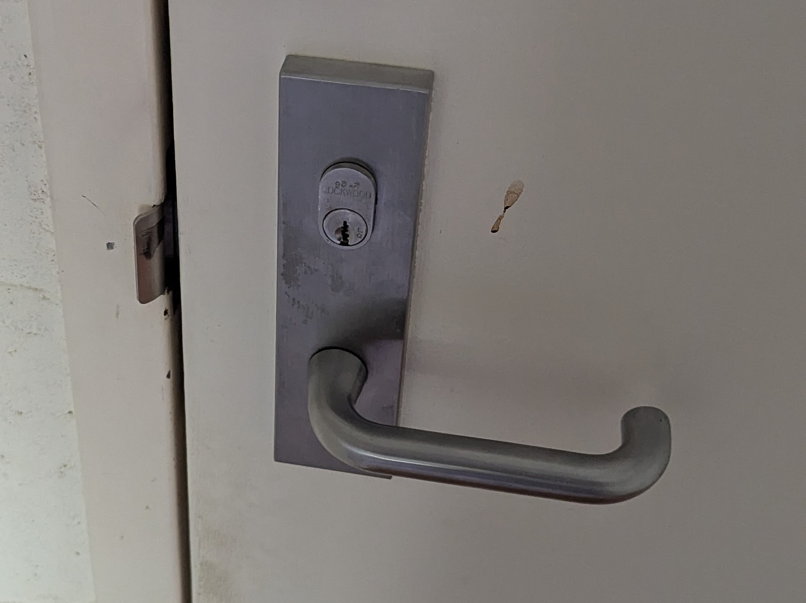
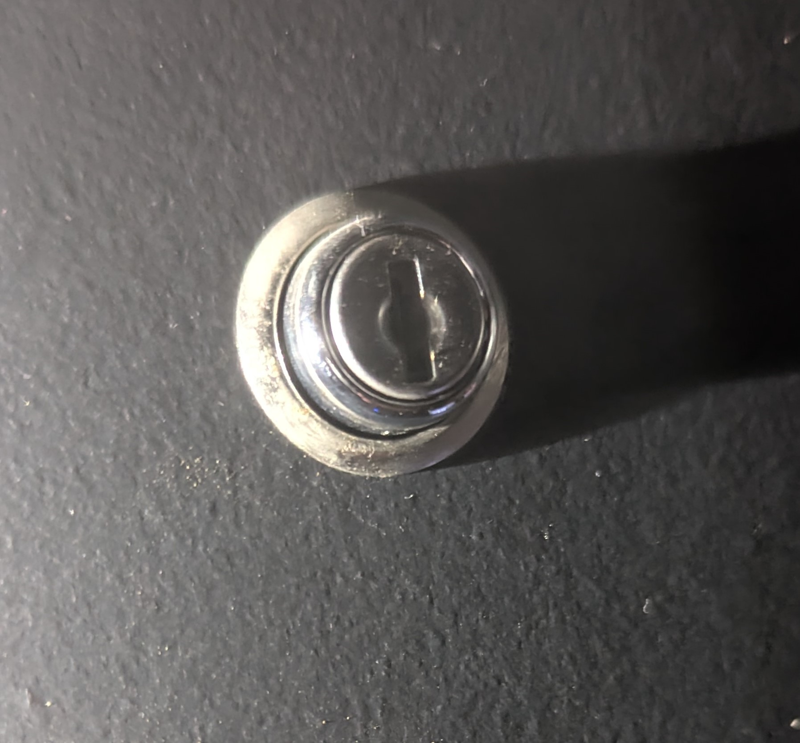
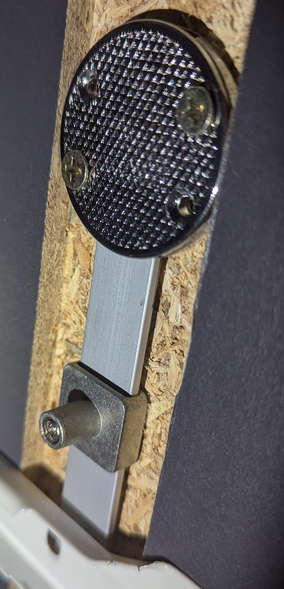
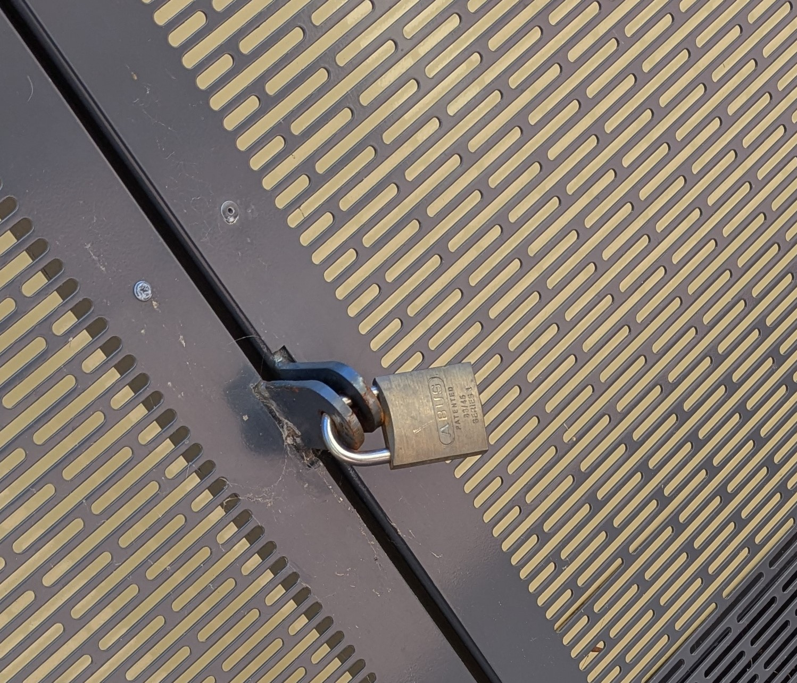
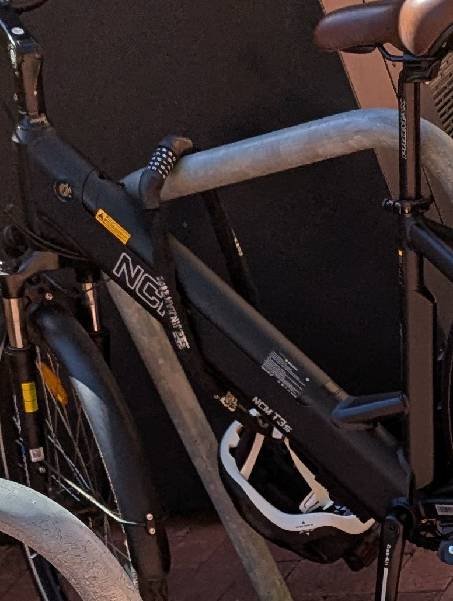
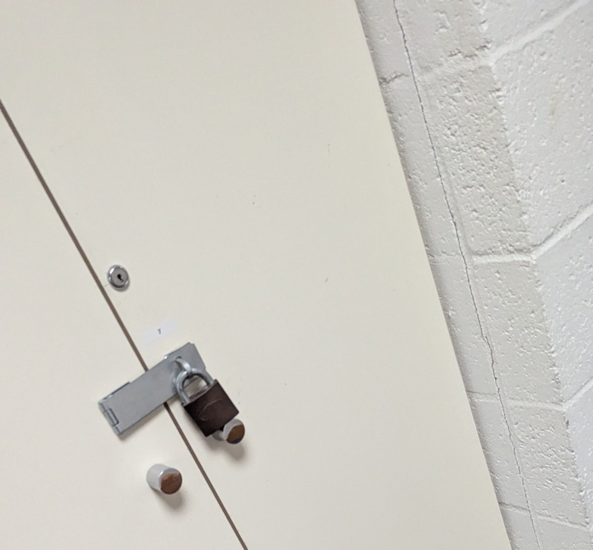
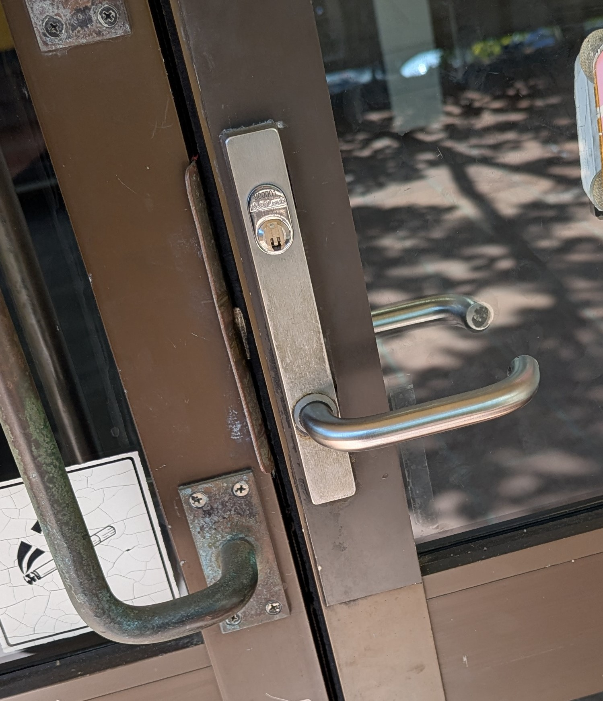
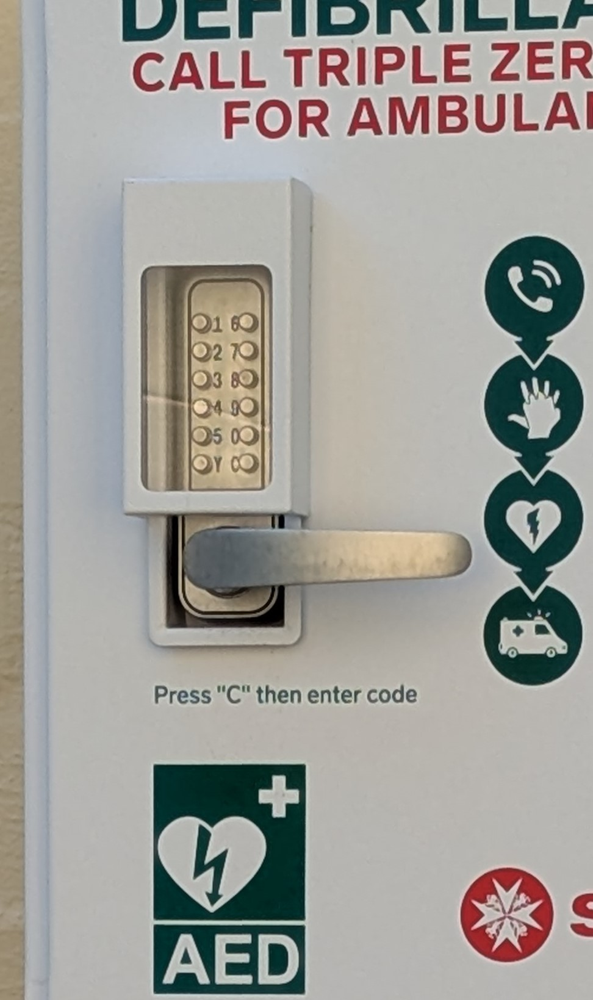

# Introduction
To complete this activity, I initially looked at lists of different types of locks. This included the following resources:
- https://blog.locksandsafes.com/2020/07/28/what-are-the-different-kinds-of-locks/
- https://securitysnobs.com/Types-Of-Locks.html
- https://level.co/stories/door-lock-types/

Once I had identified the different types of locks, I chose 10 of these and individually researched them to comment on them meaningfully and compare their advantages and disadvantages easier.

## Warded Locks
Warded locks are one of the oldest types of locks, and use obstructions (called wards) to block the rotation of keys not designed for that lock. This works by using specially designed keys which avoid the wards, allowing only the correct key to turn. Aside from the wards in lock body, it is mostly empty space which can be easily picked. Consequently, these locks are low security because they solely rely on the wards as protection.

## Wafer Tumbler Locks
Wafer locks use flat metal wafers to control the mechanism. These wafers are pushed into the keyway using springs, which also offers some additional lockpicking security. Once the key is inserted into the keyway, the key's cuts push the wafers to a shear line which allows the cylinder to rotate freely. An incorrect key will pull the wafers down only part of the way or too far, ensuring that only the correct key will move the wafers to the shear line. These locks can either be single-wafer or double-wafer. Single-wafer locks will have the wafers only on one side of the lock body, while a double-wafer lock will have wafers on both sides of the lock body (as well as cuts on both sides of the key).

## Pin Tumbler Locks
Pin tumbler locks are one of the most basic types of locks, and the mechanism is used within various other locks (like padlocks). They use a set of (typically 6) spring-loaded vertical pins which control the locking mechanism. The key pushes the pins to a shear line, allowing it to rotate the cylinder freely. Every pin is split into two components which create the pinstack - the key pin and the driver pin. The key pins sit at the bottom of each pin stack, which are rounded at the end to allow the key cuts to slide past them easily. The driver pins sit on top, and cross the shear line while the lock is at rest to prevent the lock from being rotated.

There are (what are assumed to be) pin tumbler locks located at various points on UWA's main campus, with this particular one being located on the ground floor's exit door in the Computer Science building. \

## Tubular Locks
Tubular locks use a similar mechanism to pin tumbler locks, with the name referring to the fact that the keyface is circular rather than the internal mechanism of the lock. Unlike pin tumbler locks, tubular locks arrange the pins into a circular formation around the keyway and typically contain 8 pins which move horizontally rather than vertically. The key is also circular to accomodate this, with a notch on one side to make the orientation of the key clear. Additional cuts are made to the key's body which correspond with the pin positions to push the pins to the shear line allowing the key plug to freely rotate. Because of the circular shape, these locks are harder to pick than pin tumbler locks (and therefore offer better security) but can still be picked fairly easily.

## Disc Detainer/Tumbler Locks
Disc detainer locks are composed of rotating discs in the lock body. These discs have a notch on the perimeter known as a gate. When the discs are rotated so that all of their gates line up, a sidebar inside the lock cylinder (which usually prevents the cylinder from moving) is dropped allowing it to rotate freely. The key is similar to a pin tumbler key, with its groove being used to rotate the discs specific amounts to make the disc notches line up so that the lock can be unlocked. A key with the wrong notches would mean that at least one disc is rotated incorrectly, preventing the cylinder from being rotated. These are often difficult to pick because of the precision involved in lining up every disc and the lack of feedback (unlike pin tumblers which have springs for feedback). They also sometimes include false gates which have shallower cut-outs than the true gates making picking more difficult.

## Electronic/Keyless-Entry/Smart Locks
Electronic locks are unlike any other type of lock as they rely on electrical power to operate rather than mechanical components. They are often unlocked using something like a keypad, NFC card, or biometric data which can make them more convenient than keyed locks, but some also include a non-electric override using a physical key in case the electronics ever fail. These locks use a small electric motor to control the locking mechanism in combination with something like a deadbolt, and only retract the lock when a valid key is used. Although these locks are often said to be more secure than keyed locks by some people, most of these locks still include a manual override using a keyed lock which would make it the weakest link still (and so the security relies on whatever lock type the keyed lock is).

## Cam Locks
Cam locks are commonly used to lock things like cabinets and lockers. They have two components - the lock body (which mostly sits flush with the enclosure), and a lever attached to the back known as a cam. Much like other types of keyed locks, the key moves the internal pins to a shear line which allows it to turn. As the key is turned inside the body, the orientation of the cam will change (usually 90 degrees or 180 degrees, depending on what it is fixed to) which will allow the enclosure to open. When the enclosure is locked, the cam sits behind the frame of the enclosure which prevents it from being opened.

Cam locks are common for low security use cases. My desk happens to have a similar mechanism to lock the cabinets, which can be seen below.

## Mortise Locks
Mortise locks are a common type of lock where the lock is built into a recessed pocket of the door rather than being attached to the door's surface. They require a key to be inserted before they open, ensuring that only authorised people can access what is beyond the door. There are various types of mortise locks, including deadlocks.

## Kensington Lock
The Kensington lock is a type of lock used on portable electronic devices to keep them fixed to a stationary object. There are three types of Kensington locks which all use similar mechanisms - the Kensginton Security Slot/K-slot (typically found on larger devices), the Nano Security Slot (typically found on ultra-thin devices), and the Wedge lock slot (which are only found on Dell laptops). They consist of a metal cable and a small lock which attaches to a dedicated slot on the device. They can be attached by inserting the metal cable into the slot on the device, pushing it in until it clicks, rotating the lock's head, and using the key to secure it in place. The other end of the cable can then be looped around a stationary object to keep the device fixed. They act as anti-theft mechanisms which make quick theft attempts more difficult, but are not intended to be used as a permanent locking tool.

## Padlocks
Padlocks are a type of portable lock which are typically used to secure two objects together, such as gates, doors, etc. Most padlocks will use either a numerical combination or a convention key (or a combination of both) to unlock. They consist of a body (which contains the entire mechanism) and a U-shaped shackle (which is typically a metal piece which holds the lock in place with the body). The shackle will often (but not always) include some sort of notch to act as a catch within the lock body, keeping it locked until the lock cylinder is rotated. In general, the weakest links in a padlock will be the material construction and type of mechanism used for keyed locks. Both of these could be the weakest link, meaning that security can significantly vary from lock to lock.

Padlocks are one of the most common types of locks used in public spaces. This particular padlock was being used to lock a cabinet on the outside of the Physics building near the Math building. \

## Miscellaneous Locks
Below are a few locks which I found but could not identify what type of lock they were or they did not fit the above categories.

The first lock I found was a bike lock being used near the Physics building on campus. \

The second lock I found was a combination of a padlock and seemingly a cam lock being used on a cabinet on the gorund floor of the Computer Science building, which offers extra security compared to just using one or the other. \

The third lock I found was on the entrance to the Computer Science building. Without seeing the key it would be hard to identify what type of mechanism it uses. \

The fourth lock I found was a keypad lock being used to hold the defibrillator near the Computer Science building on campus. \

 

# References
Shivam. "What are the Different Kinds Of Locks?". LocksandSafes.com. Accessed: Mar. 16, 2026. [Online]. Available: https://blog.locksandsafes.com/2020/07/28/what-are-the-different-kinds-of-locks/

Security Snobs. "Types of Locks". Accessed: Mar. 16, 2026. [Online]. Available: https://securitysnobs.com/Types-Of-Locks.html

Level Home. "16 Types of door locks & their uses". Accessed: Mar. 16, 2026. [Online]. Available: https://level.co/stories/door-lock-types/

Bai Fu Co. Ltd. "How does the lock work - Warded lock | Armstrong Story Time". Accessed: Mar. 16, 2026. [Online]. Available: https://www.armstronglocks.com/news-detail/how-does-the-lock-work-warded-lock-armstrong-story-time.htm

Grimworkshop. "HOW TO USE A WARDED LOCK PICK". Accessed: Mar. 16, 2026. [Online]. Available: https://grimworkshop.com/blogs/news/how-to-use-a-warded-lock-pick

D. Maltsev. "What Is A Wafer Lock?". UHS Hardware. Accessed: Mar. 16, 2026. [Online]. Available: https://www.uhs-hardware.com/blogs/glossary/what-is-a-wafer-lock

M. Brain and T. Harris. "How Lock Picking Works". HowStuffWorks. Accessed: Mar. 16, 2026. [Online]. Available: https://home.howstuffworks.com/home-improvement/household-safety/lock-picking3.htm

Allegion. "What is a wafer lock?". Accessed: Mar. 16, 2026. [Online]. Available: https://kc.allegion.com/kb/article/what-is-a-wafer-lock/

D. Maltsev. "What Is A Pin Tumbler Lock?". UHS Hardware. Accessed: Mar. 16, 2026. [Online]. Available: https://www.uhs-hardware.com/blogs/glossary/what-is-a-pin-tumbler-lock

SouthOrd. "Understanding the Anatomy of Different Lock Types". Accessed: Mar. 16, 2026. [Online]. Available: https://www.southord.com/blogs/news/understanding-the-anatomy-of-different-lock-types

ARCO Lock & Security. "How a Pin Tumbvler Lock Works". Accessed: Mar. 16, 2026. [Online]. Available: https://www.arcolock.com/blog/how-a-pin-tumbler-lock-works

Wikidot Inc. "Understanding The Pin Tumbler Mechanism". Accessed: Mar. 16, 2026. [Online]. Available: http://lockpickernetwork.wikidot.com/understanding-the-pin-tumbler-mechanism

B. Hooper. "What's A Tubular Key?". Keytek Training Academy. Accessed: Mar. 16, 2026. [Online]. Available: https://www.locksmiths-training.co.uk/blog/whats-a-tubular-key/

Glenferrie Locksmiths. "What are Tubular Locks?". Accessed: Mar. 16, 2026. [Online]. Available: https://glenferrie-locksmiths.com.au/what-are-tubular-locks.html

J. Douglas. "A Guide to Tubular Locks". CLK Supplies. Accessed: Mar. 16, 2026. [Online]. Available: https://www.clksupplies.com/blogs/news/a-guide-to-tubular-locks

P. Slauson Jr. "How to Pick a Tubular Lock: A Beginner's Guide to Tubular Lock Picking". Lockpicks.com. Accessed: Mar. 16, 2026. [Online]. Available: https://www.lockpicks.com/blogs/blogs/how-to-pick-a-tubular-lock-a-beginners-guide-to-tubular-lock-picking

Amthy Lock. "Disc Tumbler Lock". Accessed: Mar. 16, 2026. [Online]. Available: https://amthy.com/en/disc-tumbler-lock/

The LockLab. "TYPES OF LOCKS - BOSNIANBILL'S LOCKLAB". Accessed: Mar. 16, 2026. [Online]. Available: https://locklab.com/types-of-locks-bosnianbills-locklab/

Driscoll's Locksmith. "What Are Electric Door Locks and How Do They Work?". Accessed: Mar. 16, 2026. [Online]. Available: https://driscolllockandkey.com/what-are-electronic-locks-and-how-they-work/

iLOQ Ltd. "What are the benefits of electronic locks?". Accessed: Mar. 16, 2026. [Online]. Available: https://www.iloq.com/en-gb/marketing/electronic-lock/

Monroe Engineering LLC, Inc. "An Introduction to Cam Locks and How They Work". Accessed: Mar. 16, 2026. [Online]. Available: https://monroeengineering.com/blog/an-introduction-to-cam-locks-and-how-they-work/

A. McGoruty. "WHAT IS A MORTICE LOCK? WHEN AND WHERE TO USE THEM". John Barnes Group. Accessed: Mar. 16, 2026. [Online]. Available: https://johnbarnesgroup.au/what-is-a-mortice-lock-when-and-where-to-use-them/

Keri Systems. "What Is A Mortise Lock And What Are The Benefits Of Using One?". Accessed: Mar. 16, 2026. [Online]. Available: https://kerisys.com/resources/what-is-a-mortise-lock-and-the-benefits-of-using-one/

Lenovo. "What is a Kensington lock?". Accessed: Mar. 16, 2026. [Online]. Available: https://www.lenovo.com/au/en/glossary/kensington-lock/

Kensington Computer Products Group. "Types of Laptop Locks: K‑Slot, Nano & Wedge Explained". Accessed: Mar. 16, 2026. [Online]. Available: https://www.kensington.com/news/security-blog/types-of-laptop-locks-kslot-nano-wedge-explained/

C. Barry. "Everything You Need To Know About Padlocks". Elocksys, Inc. Accessed: Mar. 16, 2026. [Online]. Available: https://elocksys-garage.com/padlocks-complete-guide/

Assa Abloy AB. "Everything you need to know about padlocks". Accessed: Mar. 16, 2026. [Online]. Available: https://www.uniononline.co.uk/uk/en/knowledge-centre/everything-you-need-to-know-about-padlocks