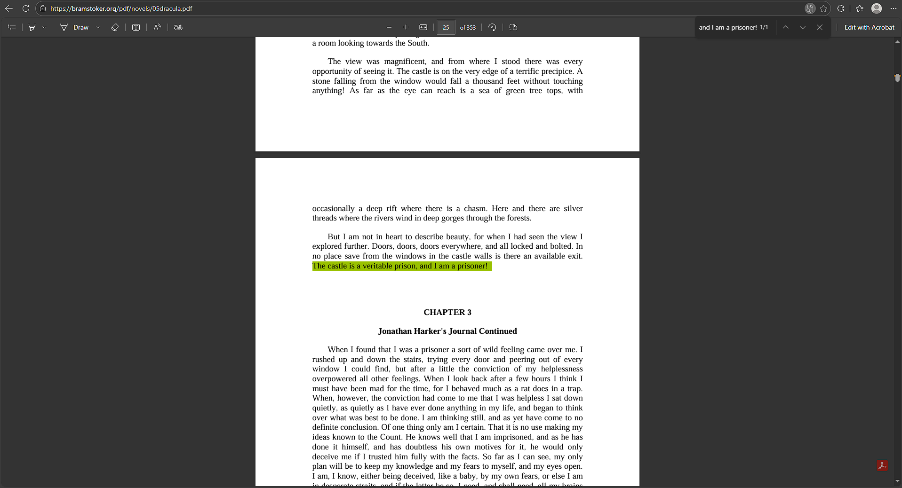
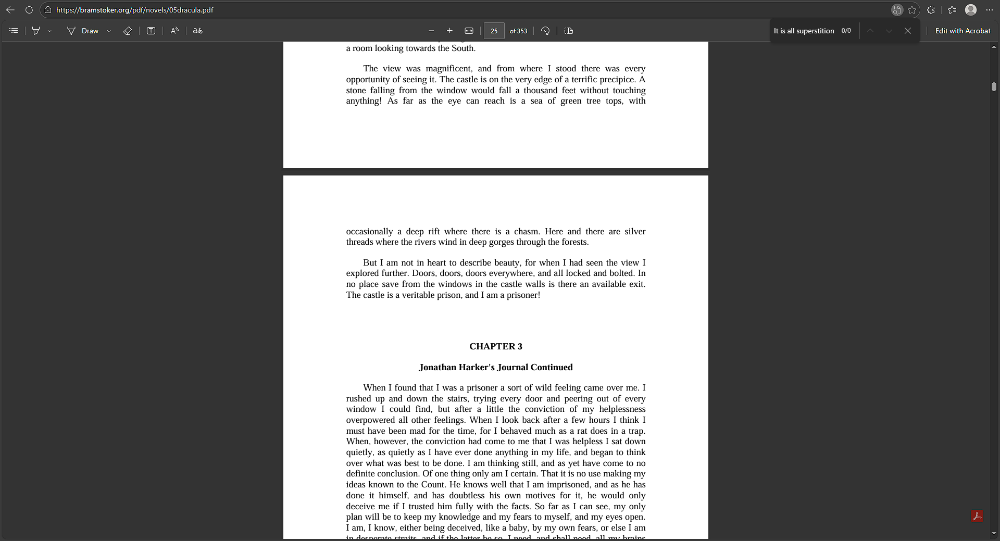

# Introduction
To complete this activity, I used the free version of ChatGPT using GPT-5.2 (the current model available for free users as of 23/02/2026) as it is the most popular LLM currently available. Consequently, it is also the most likely to hallucinate because it lacks features that other, more premium models have like thinking capabilities. In order to force the model to hallucinate, I tried various things and found that it hallucinated in very specific circumstances.

Note that the specific chats can be accessed by clicking on each heading for verification purposes.

## [Case 1](https://chatgpt.com/share/699c5cfa-a8b0-800b-870b-d807523412c9)
The first thing I tried which got the model to hallucinate was generating quotes from a book, which it is notoriously awful at. In order to test this, I used the following prompt:
> Generate some quotes from Bram Stoker's 'Dracula' novel that showcase how Transylvania maintains conventions of the gothic genre.

This particular prompt was inspired by a previous assignment in which I wrote an essay on a similar topic for ATAR English in 2023. In order to check that the quotes were valid, I used the find command in my PDF viewer on a PDF copy of the book available [here](https://bramstoker.org/pdf/novels/05dracula.pdf) (the book was published in 1897 so it should be in the public domain). An example of this can be seen with the third quote, which I directly copied from the output:

The generated output was surprisingly coherent. It seemingly generated some quotes from the novel and explained their significance to my query in some level of detail (some of which isn't necessarily true, but checking the validity of such information would be much harder than some quotes). After inspecting every quote, there was one that stuck out:
> It is all superstition, and I fear you will smile at me; but you must promise me not to go out of your way. The things that have been will be again.

This is an interesting quote that appears to, on the surface, be an excellent quote for such an essay. However, this quote doesn't appear in the novel at all! There are exactly 0 instances in the novel in which this exact thing is said:

Even after cutting this quote down in various ways (to the point I was looking at single words), there was nothing remotely close to this quote:

Consequently, this is one case where an LLM has hallucinated information.

## Case 2
To investigate the hallucinations further, I asked it two different but related things involving UWA. There were several reasons for this, but the most important one was the easy validation of the generated output (for obvious reasons). The specific topics I asked it about were:
- [The AI Club at UWA](https://chatgpt.com/share/69a1991d-bba0-800b-b324-6a173c96aad4)
- [Computer Science units at UWA](https://chatgpt.com/share/69a19ae7-fbd0-800b-acc8-bd9d0c76734f)

Asking it about the AI club was interesting. Although asking it about other clubs would have made for easier verification (particularly for UCC and CFC), they are significantly older clubs and it is likely that it would spit out perfectly valid information about them. This made me consider recently formed clubs, like Game Development UWA and the AI club. In the end, I chose the AI club because it was only recently formed (around mid-2025) and seemingly still not Guild-affiliated so it was less likely that it would appear in its training data but I still wanted to catch it out on a lie. To do this, I gave it a leading prompt to try and force itself to be confident in what it says:
> Can you tell me some information about the University of Western Australia's AI club? What do they do and what events do they typically hold?

The most interesting thing from the output was the inclusion of this line:
> If you want, I can also list upcoming events and workshops for this semester at UWA AI Club—it could help you see exactly what they’re currently running. Do you want me to do that?

It was seemingly certain that it could tell me about upcoming events, but any attempts to ask it about said events resulted in a response that amounted to "I don't know". Instead, I asked it about previous events held (of which there are very few, verified by what they posted on their [Instagram](https://www.instagram.com/uwaaiclub/)). This resulted in a list of events which they had seemingly never run, like NLP workshops and robotics. What is certainly of the most interest is at the end of the output, where it stated that:
> I can compile a timeline of their most notable events over the past 2–3 years

Considering the club is only a few months old, this would certainly be an odd thing to be able to tell me. When pressed about the source for its information, it admitted the following:
> I don’t have direct access to UWA AI Club’s private calendars or internal records, so I’m summarizing typical offerings rather than citing a specific official source.

After being confident in its answers for as long as it was, it backed down surprisingly quickly when pressured at all. Although this is enough to showcase the LLM hallucinating information (and admitting to doing so), this got me interested in what else I could get it to falsify regarding UWA. I asked it to recommend me some units to take as part of my degree using the following prompt:
> What are some good computer science and cybersecurity units I can do at the University of Western Australia?

Not only did it completely make up that there is a Bachelor of Computer Science and Bachelor of Cybersecurity at UWA, it also made up a bunch of units (which were seemingly like Curtin University's units, yet after some quick investigation it seems like there isn't a single university in Australia that offers units with the unit codes and names it provided). This is despite the fact that it asserted that "I can give you a detailed overview based on their current course offerings", and after asking it for further information it responded with the following: 
> The units I listed were based on common CS and cybersecurity topics at Australian universities rather than the exact UWA course catalog

Not only is this a clear contradiction in what it told me, but these units didn't appear after some (admittedly quick) searching at any Australian university. Further in the response it claims to have a list of actual units from UWA this time, but proceeds to list some of the same incorrect units as before alongside some new incorrect units. In fact, every single thing in its response was incorrect (including what the numbers in the unit codes indicate). The only correct thing in the response was the link to the UWA website (and even THAT was an invalid URL). It is rather ironic that it ends the response with "so you have the real current options — that way you won’t chase units that don’t exist" considering absolutely nothing it has said so far is correct despite what it claims.

As a result of the outcomes of these two separate (but related) queries, there are evident hallucinations in the information generated by LLMs (despite the confidence it has in its responses).