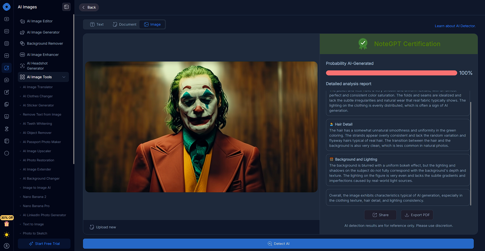
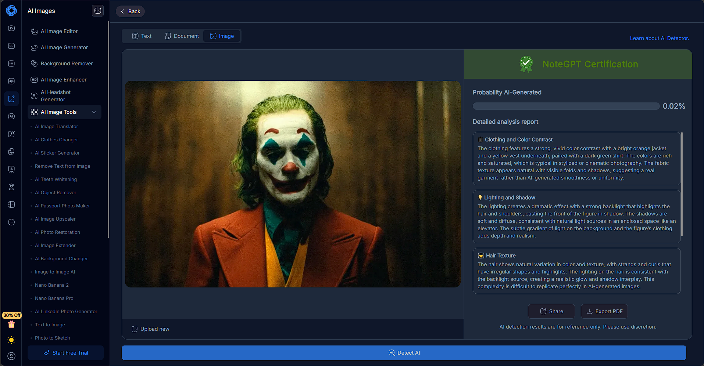

# AI Image Analysis
In order to complete this activity, I retrieved an image generated by Midjourney by Stuart Thompson for The New York Times. Specifically, I used an image that was generated of The Joker from *Joker* (2019). There was no particular reason for using this image, but having a real version of the image to compare the results to would enable comparisons between the analyses to be made (and ensure that any results aren't just flukes). To complete this activity, I used two different AI image detectors - [TruthScan](https://truthscan.com/ai-image-detector) and [NoteGPT](https://notegpt.io/ai-image-detector) - which are both free and publicly accessible tools.

The first tool I used was Truthscan's AI image detection tool. After running it with the AI generated image, it resulted in a 97% probability that the image was generated with high confidence. This result was expected because it is a known AI image.

I also ran the same analysis on the actual image that the AI generated copy is based on. This resulted in only a 53% probability that the image was AI generated with low confidence.

After using Truthscan's tool, I moved onto NoteGPT. After [running it with the AI generated image](https://notegpt.io/ai-image-detector?share=6575b15c), it was absolutely certain that the image was AI generated. It specifically noted aspects like the clothing texture, the hair detail, and background, stating that they all exhibited characteristics of AI generation.

Like with TruthScan, I also ran the [same analysis on the actual image](https://notegpt.io/ai-image-detector?share=5df28c1c) to make some comparisons between the analysis. As analysis returned just a 0.02% confidence that the image was AI generated, again citing characteristic evidence which detailed what they should be like in reality.

Consequently, it is clear that AI image detection tools can separate reality from whatever AI can produce. Both detectors used perfectly predicted the AI generated image and the real image, showcasing the differences between the two styles of image.

 

# References
S. Thompson. "We Asked A.I. to Create the Joker. It Generated a Copyrighted Image.". The New York Times Company. Accessed: Feb. 29, 2026. [Online]. Available: https://www.nytimes.com/interactive/2024/01/25/business/ai-image-generators-openai-microsoft-midjourney-copyright.html