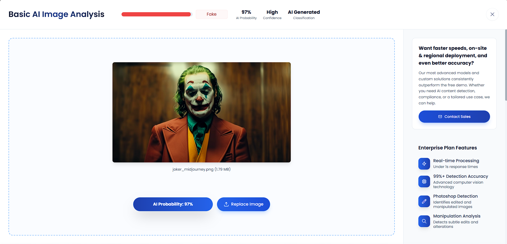
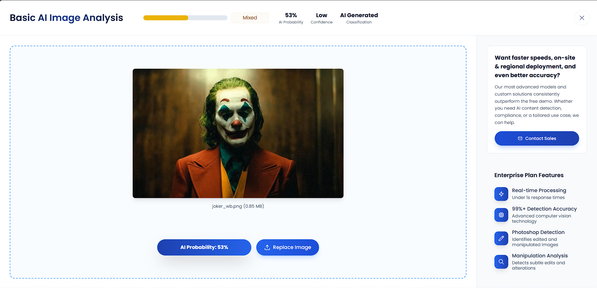

In order to complete this activity, I retrieved an image generated by Midjourney [by Stuart Thompson for The New York Times](https://www.nytimes.com/interactive/2024/01/25/business/ai-image-generators-openai-microsoft-midjourney-copyright.html). Specifically, I used an image that was generated of The Joker from *Joker* (2019). To analyse it, I used the [Truthscan AI image analysis tool](https://truthscan.com/ai-image-detector). This resulted in a 97% probability that the image was generated with high confidence, which was the expected result since this is a known AI generated image.

For fun, I wanted to compare this to the actual image the generated image is based on. This resulted in only a 53% probability that the image was AI generated with low confidence.
