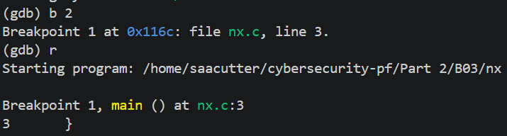
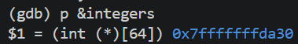
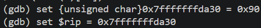
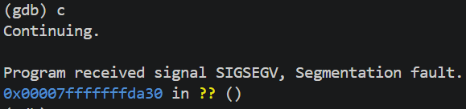
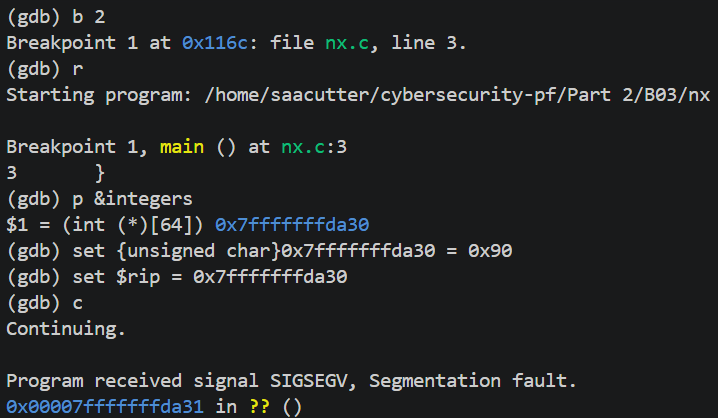
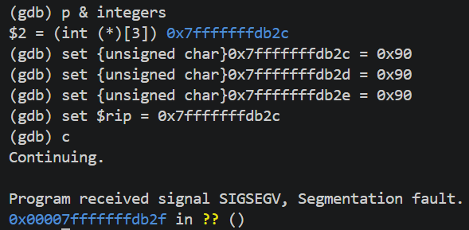

# Introduction

## Address Space Layout Randomisation (ASLR)
Address Space Layout Randomisation, or ASLR, is a technique built into modern operating systems which randomises the memory locations of any allocated memory (including system files, libraries, programs, etc). This makes it harder for attackers to predict where code will load, which makes exploits harder to perform. This helps defend against many memory-based exploits (the most common type of exploits), such as buffer overflow and code injection attacks, which rely on knowing the exact addresses of data in the system's memory to execute the attack (often in the form of "shellcode").

This can be tested using a basic C script which allocates a pointer onto the stack and prints the memory address of the pointer.
```
#include <stdio.h>
#include <stdlib.h>

int main(void) {
    int *p = (int *)malloc(sizeof(int));
    printf("%p\n", &p);
    free(p);
}
```
After compiling this script, the memory address that gets printed will change every time the program is run. This change makes memory exploit attacks significantly more difficult to perform, and since this is an automatically enabled feature it is also a proactive security mechanism.


Disabling this feature typically requires altering the operating system kernel, so it is highly recommended that this feature is never disabled.

## Memory Protection Features
...

Windows supports these features with Data Execution Prevention (DEP).

This can be showcased using an extremely basic C script and the assistance of GDB (though any C debugger should work for this). The C script only needs to contain an allocated buffer, which can be done by initialising an empty array of any arbitrary size (though the larger the better).
```
int main() {
    int integers[64];
}
```
This script needs to be compiled with debugging symbols enabled (with the `-g` compilation flag) and no optimisation done (with the `-O0` compilation flag) since this would otherwise optimise the array away. By default, the binary produced will have a non-executable stack - this is important for later. The produced binary can then be analysed using `gdb`.

In the GDB interface, a breakpoint needs to be established after the the buffer declaration but before the end of the function's (or in this case the entire program's) termination. This can be done with `b 2`, which sets a breakpoint at the third line of the program. Once the breakpoint has been established, the program can be run (using `r`) which will automatically stop execution at the breakpoint. 



At this point, the buffer has been initialised so it has a memory address. This memory address can be accessed using `p &integers`.



Now that the memory address is known, it can have some shellcode instructions assigned to it. This can be any instruction, but for demonstration purposes the `NOP` instruction (which has the hexcode of `0x90`) will be used since this does nothing. After this is done, the Register Instruction Pointer (or the `$rip` register), which contains the memory address of the next instruction, can be set to the start of this buffer. This will mean that the next instruction to be executed is whatever is in the buffer.



Now that the preparation is complete, the program can continue running with `c`.

This results in a segmentation fault being raised at the address of the buffer because it is not executable, as expected.



This binary can be recompiled, ensuring that the stack is made executable using the `-z execstack` compilation option, and this process repeated.



Notably, the segmentation fault occurred at one address position beyond the buffer's memory address. This is actually behaving as expected because there was no instruction set to that position, and the `NOP` instruction makes the `rip` register continue executing every instruction in the buffer. As arrays in C are contiguous spaces of memory, this means that the segmentation fault signal will be raised at the first position (or memory address) in the array which does not have an instruction.

Note that the following screenshot has a different memory address compared to the previous screenshots - this is due to ASLR using different memory addresses.



In this case, the segmentation fault signal was raised at `0x7fffffffdb2f` which is 4 positions after the initial memory address (`0x7fffffffdb2c + 4 = 0x7fffffffdb2f`). This means that the signal is raised even beyond the buffer's bounds. This principle (i.e. inserting shellcode into a buffer and reading it) is similar to how buffer overflow attacks work.

## Sandboxing
Sandboxing is a 

# References
Australian Signals Directorate. "The case for memory safe roadmaps". Accessed: May 17, 2026. [Online]. Available: https://www.cyber.gov.au/business-government/secure-design/secure-by-design/the-case-for-memory-safe-roadmaps

L. Danielson. "What is ASLR? and why does it matter for cybersecurity". Huntress. Accessed: May 17, 2026. [Online]. Available: https://www.huntress.com/cybersecurity-101/topic/what-is-address-space-layout-randomization-aslr

N. Gupta. "Demystifying ASLR: Understanding, Exploiting, and Defending Against Memory Randomization". Accessed: May 17, 2026. [Online]. Available: https://securitymaven.medium.com/demystifying-aslr-understanding-exploiting-and-defending-against-memory-randomization-4dd8fe648345

A. Dhital. "Brief explanation of stack based buffer overflow vulnerability and attack scenerio". Accessed: May 19, 2026. [Online]. Available: https://medium.com/@alexdhital250/brief-explanation-of-stack-based-buffer-overflow-vulnerability-and-attack-scenerio-df99dc32d0e0

A. Alheraki. "Intel x86-64 Instruction Set Quick Reference". Accessed: May 19, 2026. [Online]. Available: https://simplifycpp.org/books/Assembly/Intel_x86_64_Instruction_Set_Quick_Reference.pdf

Brown University. "Lecture 8: Assembly Language, Calling Convention, and the Stack". Accessed: May 19, 2026. [Online]. Available: https://cs.brown.edu/courses/csci1310/2020/notes/l08.html