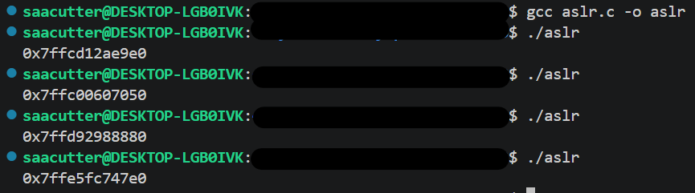

# Introduction

## Address Space Layout Randomisation (ASLR)
Address Space Layout Randomisation, or ASLR, is a technique built into modern operating systems which randomises the memory locations of any allocated memory (including system files, libraries, programs, etc). This makes it harder for attackers to predict where code will load, which makes exploits harder to perform. This helps defend against many memory-based exploits (the most common type of exploits), such as buffer overflow and code injection attacks, which rely on knowing the exact addresses of data in the system's memory to execute the attack (often in the form of "shellcode").

This can be tested using a basic C script which allocates a pointer onto the stack and prints the memory address of the pointer.
```
#include <stdio.h>
#include <stdlib.h>

int main(void) {
    int *p = (int *)malloc(sizeof(int));
    printf("%p\n", &p);
    free(p);
}
```
After compiling this script, the memory address that gets printed will change every time the program is run. This change makes memory exploit attacks significantly more difficult to perform, and since this is an automatically enabled feature it is also a proactive security mechanism.



Disabling this feature typically requires altering the operating system kernel, so it is highly recommended that this feature is never disabled.

## Memory Protection Features
...

Windows supports these features with Data Execution Prevention (DEP).

## Sandboxing
Sandboxing is a 

# References
https://www.cyber.gov.au/business-government/secure-design/secure-by-design/the-case-for-memory-safe-roadmaps

https://www.huntress.com/cybersecurity-101/topic/what-is-address-space-layout-randomization-aslr

https://securitymaven.medium.com/demystifying-aslr-understanding-exploiting-and-defending-against-memory-randomization-4dd8fe648345