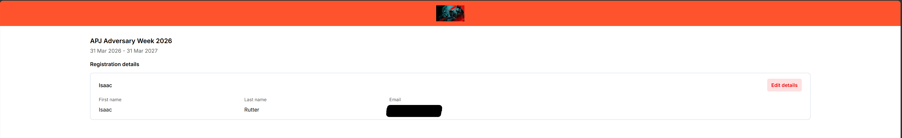

# Introduction
To complete this activity, I participated in CrowdStrike's annual [Adversary Week](https://www.crowdstrike.com/en-us/events/adversary-week/), an entirely online event where CrowdStrike's security experts share insights into the current threat landscape through a series of interactive seminars. The event, while open to everyone, is primarily aimed at security defenders as it focuses on analysing modern adversaries and identifying strategies to strengthen defence.

This year's event focused on the increased prominence of artificial intelligence in cyberattacks, highlighting how AI is accelerating adversary capabilities and increasing the complexity of modern defence mechanisms. Topics covered by the seminars included cross-domain attacks, ransomware attacks, identity-based attacks, and prompt injection attacks. 

## Identity-Based Attacks
Although I did sign up to five of these seminars, I was only able to participate in one due to incompatibilities with my schedule. Specifically, I participated in the Identity-Based Attacks seminar since this was the one which aligned with the unit content the most and the one I had the most interest in.

This seminar, as the name suggests, focused on identity-based attacks and how to prevent them. It began with an insight into the evolution of identity-based attacks, and made note of how IAM systems were designed for control rather than security (and hence have no security/risk alerts). The seminar then moved onto insights into modern adversaries, including their motivations, landscape, and threat intelligence. 

The seminar then features a brief demo of CrowdStrike's Falcon platform, and how it can be used to protect against threats in real-time across all of an organisation's applications with native integration. Finally, the seminar ended with a Q&A session where they answered some of the questions that other participants had during the seminar.

## Conclusion
Although this was essentially an advertisement, the entire event (like most events that organisations hold) are essentially just marketing tactics so this wasn't surprising.