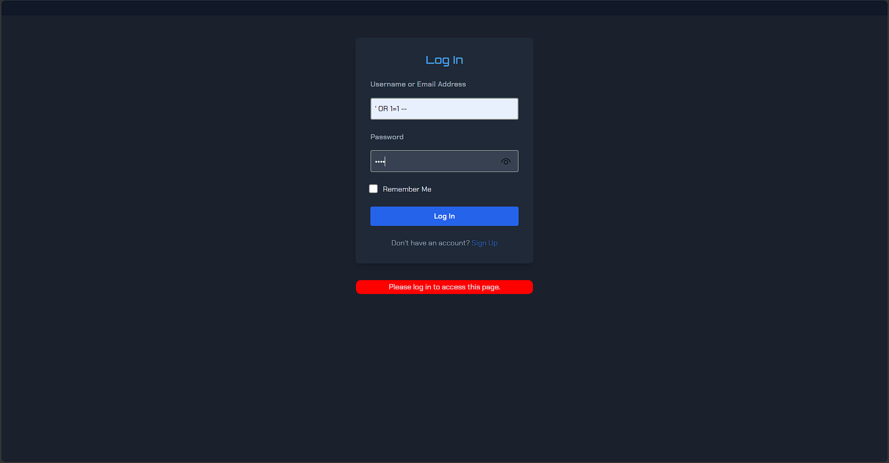
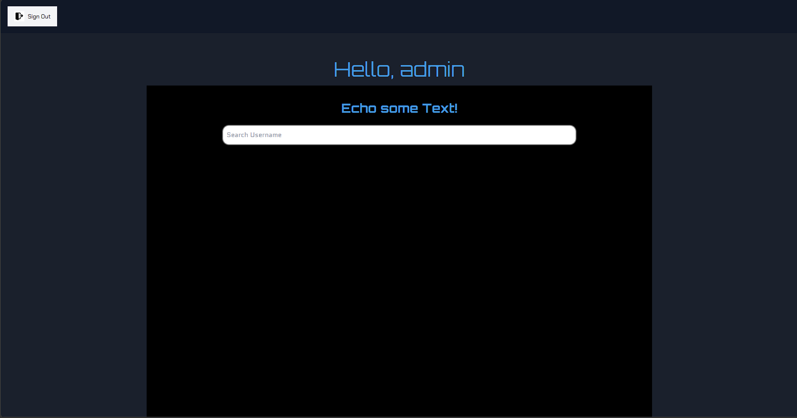
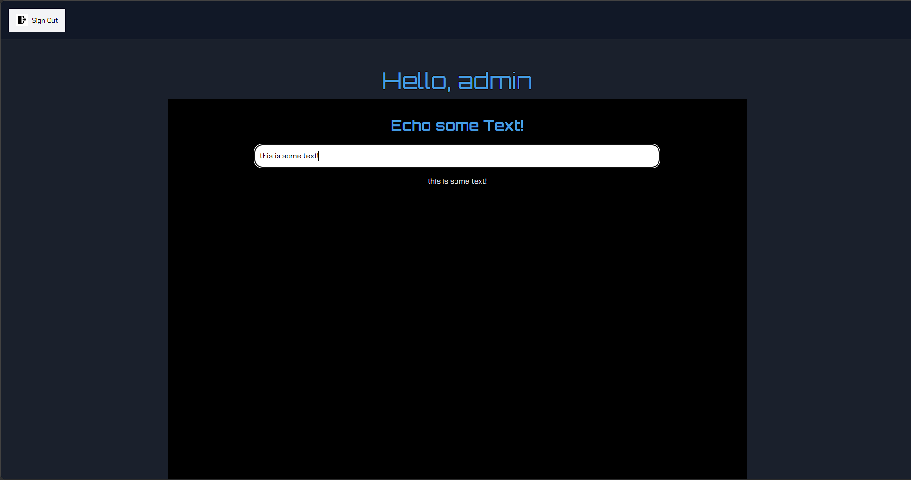
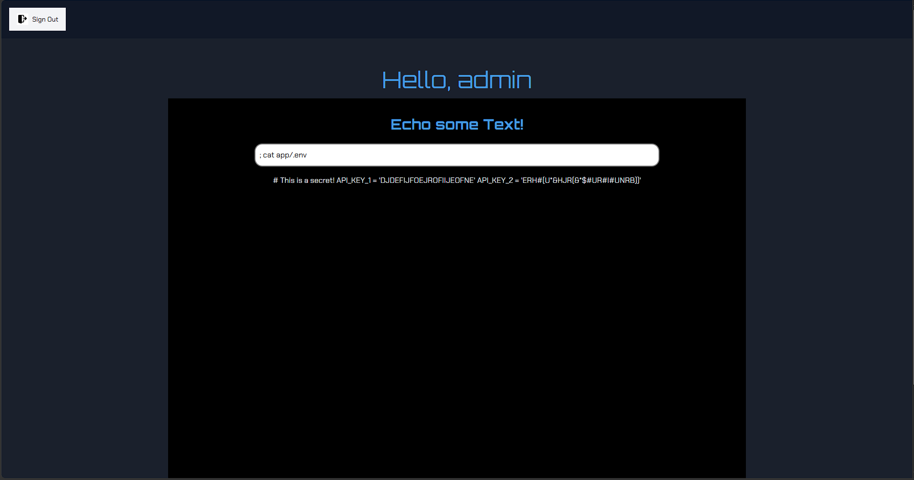

For this activity, the learning activity I created was an activity to showcase SQL injection and command injection attacks. This was built as a Flask application, reusing some resources from my Agile Web Development project (as the application itself was not part of the activity).

SQL injection is implemented using a poorly constructed SQL query interfaced with the `sqlite3` library. Against recommended advice, it uses a format string which makes it vulnerable to injection attacks. 

A dummy admin account is provided as the first user in the database, so an injected string will automatically be logged in as the admin user.

As the admin user, special privileges are given to them that no other user account has. On the homepage, they are able to enter a line of text and see it displayed on the page instantly. 

However, this is implemented using the `os.system()` function. Consequently, it is vulnerable to command injection which can leak sensitive information.
