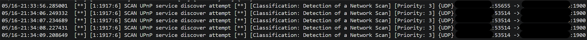
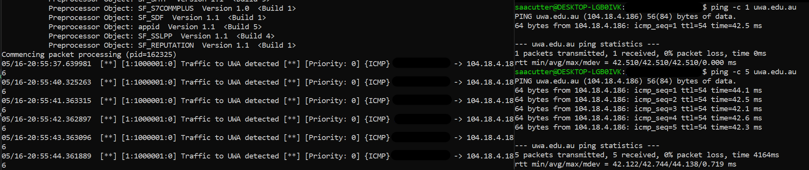
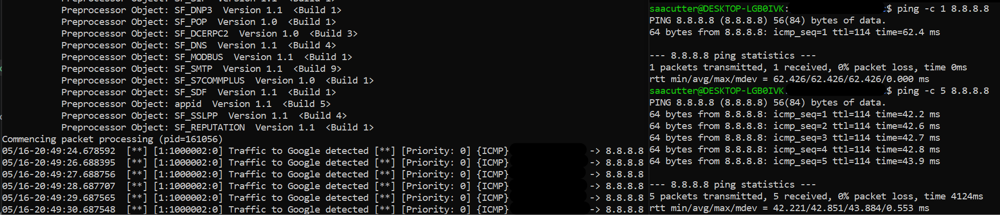
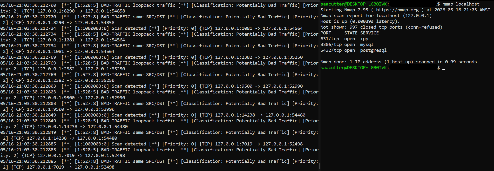

# Introduction
To complete this activity, I tested the effectiveness of Snort. Snort is an open-source tool which, despite what its website (inconsistently) says, is both an intrusion detection system and intrusion prevention system (though for the purposes of this activity it is only an IDS). It is a knowledge-based/signature-based network intrusion detection system (NIDS), meaning it uses the signatures of network packets to determine whether the traffic (both incoming and outgoing) is malicious. Snort was chosen due to its ease of use and availability on the aptitude package manager, making installation quick and easy.

In order to test how effective Snort is as an IDS, various tests need to be performed. It comes with several built-in rules, but also supports custom rules so these will be tested independently. Snort will be initialised across all tests using `sudo snort -A console -c /etc/snort/snort.conf -i eth0` to ensure that tests are controlled and consistent. This uses various options in order to make identifying alerts easier - `-A console` sends alerts to the terminal, `-c /etc/snort/snort.conf` tells Snort to use `/etc/snort/snort.conf` as the rule file, and `-i eth0` makes Snort listen on the provided network interface (with `eth0` indicating that it should listen to the traffic on the first wired link).

## Built-In Rules
The first thing to do would be to test how effective the built-in rules are since these will likely be the ones most commonly activated. To test this, the [`testmynids.org` framework developed by 3CORESec](https://github.com/3CORESec/testmynids.org) will be used. Following the instructions provided on the README, every test is executed automatically by running `curl -sSL https://raw.githubusercontent.com/3CORESec/testmynids.org/master/tmNIDS -o /tmp/tmNIDS && chmod +x /tmp/tmNIDS && /tmp/tmNIDS -99`.

Due to how long the output was, not everything can be shown. However, the more notable events (with IP redactions as a precaution) are provided:
```
05/16-21:17:10.109121  [**] [1:498:6] ATTACK-RESPONSES id check returned root [**] [Classification: Potentially Bad Traffic] [Priority: 2] {TCP} 3.163.44.102:80 -> ip:38008
05/16-21:17:10.109121  [**] [1:1882:10] ATTACK-RESPONSES id check returned userid [**] [Classification: Potentially Bad Traffic] [Priority: 2] {TCP} 3.163.44.102:80 -> ip:38008
05/16-21:17:10.110155  [**] [1:498:6] ATTACK-RESPONSES id check returned root [**] [Classification: Potentially Bad Traffic] [Priority: 2] {TCP} 3.163.44.102:80 -> ip:38008
05/16-21:17:10.110155  [**] [1:1882:10] ATTACK-RESPONSES id check returned userid [**] [Classification: Potentially Bad Traffic] [Priority: 2] {TCP} 3.163.44.102:80 -> ip:38008
05/16-21:17:50.246320  [**] [1:1201:7] ATTACK-RESPONSES 403 Forbidden [**] [Classification: Attempted Information Leak] [Priority: 2] {TCP} 3.163.44.102:80 -> ip:44844
05/16-21:17:51.117585  [**] [1:1201:7] ATTACK-RESPONSES 403 Forbidden [**] [Classification: Attempted Information Leak] [Priority: 2] {TCP} 3.163.44.102:80 -> ip:44846
05/16-21:17:51.983306  [**] [1:1201:7] ATTACK-RESPONSES 403 Forbidden [**] [Classification: Attempted Information Leak] [Priority: 2] {TCP} 3.163.44.82:80 -> ip:35350
05/16-21:17:52.847377  [**] [1:1201:7] ATTACK-RESPONSES 403 Forbidden [**] [Classification: Attempted Information Leak] [Priority: 2] {TCP} 3.163.44.65:80 -> ip:58940
05/16-21:17:52.888707  [**] [1:1201:7] ATTACK-RESPONSES 403 Forbidden [**] [Classification: Attempted Information Leak] [Priority: 2] {TCP} 3.163.44.129:80 -> ip:37730
05/16-21:17:53.729165  [**] [1:1201:7] ATTACK-RESPONSES 403 Forbidden [**] [Classification: Attempted Information Leak] [Priority: 2] {TCP} 3.163.44.129:80 -> ip:37736
```

Note that some of the tests couldn't execute due to a dependency issue. However, potentially malicious traffic was consistently being detected.

In addition, while preparing to perform these tests, random scanning attempts were being detected. These scanning attempts were attempting to find UPnP devices on my local network, though the exact cause of these scanning attempts is unknown.


As the simulated malicious traffic was consistently being alerted, it appears that the built-in rules are effective (and consequently, Snort is also effective as an IDS). Although there were some apparent false positives, this is still significantly better than false negatives which could potentially compromise the system.

## Custom Rules
Snort supports custom rules with the `local.rules` file, which makes it highly flexible for different network environments or security requirements. These rules have the following format:
```
action protocol sourceIP sourcePort -> destIP destPort (body)
```

There are 5 basic `action`s that can be set which adjust what occurs when a packet matches the rule - alert (which generates an alert), block (which blocks the packet), drop (which drops the packet), log (which logs the packet), and pass (which allows the packet). There are 4 `protocol`s which are currently supported - `ip`, `icmp`, `tcp`, and `udp`. The `sourceIP`, `sourcePort`, `destIP`, and `destPort` all represent the source/destination IP addresses/ports of the incoming packet, which can be configured as required.

The rule body has a few options that can be set, but the only ones required are `msg` and `sid`. `msg` is used to set the message which should be printed if the rule is matched, accepting a string value. `sid` is used to set the signature number assigned to a Snort rule (with local rules recommended to start at 1000000 since the built-in rules cover the values before this). Although this option is not required, it is recommended that all rules have one so this will be followed.

Now that the rule structure has been identified, we can start to make our own custom rules. In every case, the `action` will be set to `alert` since we only need to identify that something suspicious occurred (and since this is a controlled test, none of the traffic should be malicious). The `sourceIP`, `sourcePort`, and `destPort` will also always be set to `any` since these aren't important. To simulate malicious traffic, `ping` and `nmap` will be used. Specifically, `ping` will be used on Google's IP address and UWA's IP address while `nmap` will be used on localhost (with Snort listening to the `lo` interface). These rules can be written to the `local.rules` file to add these rules.
```
# $Id: local.rules,v 1.11 2004/07/23 20:15:44 bmc Exp $
# ----------------
# LOCAL RULES
# ----------------
# This file intentionally does not come with signatures.  Put your local
# additions here.
alert icmp any any -> 104.18.4.186 any (msg: "Traffic to UWA detected"; sid:1000001;)

alert icmp any any -> 8.8.8.8 any (msg: "Traffic to Google detected"; sid:1000002;)

alert tcp any any -> any any (msg: "Scan detected"; sid:1000003;)
```

After running Snort with these newly defined custom rules, they can be tested. To test rules `1000001` and `1000002`, the associated destination can be `ping`ed (which would send an ICMP packet). These `ping`s can be run as `ping -c n dest`, where `n` is the number of packets we want to send and `dest` is the destination IP specified in the rules. The results of this can be seen below:



To test rule `1000003` (which should detect all TCP traffic for testing purposes), an `nmap` scan can be run on `localhost`. This can be run as `nmap localhost` with Snort running on the loopback interface (i.e. `-i lo`) to listen for this traffic.


As shown in the screenshots above, the custom rules created alerts every time a packet matching the created rule was identified. This demonstrates Snort's ability to reliably detect signatures explicitly defined in its ruleset.

# Conclusion
This testing demonstrates that Snort is an effective intrusion detection system for identifying suspicious network activity, with both the built-in rules and custom rules successfully generated alerts to simulated malicious traffic. However, its effectiveness heavily depends on the quality and specificity of the created rules as false positives can be generated and unknown/modified attacks can bypass detection entirely if the packet doesn't match any rule.

It should be noted that, as a signature-based NIDS, Snort is only effective against malicious traffic it can recognise. However, as the signature database is likely to be outdated, Snort may fail to detect malicious traffic with unknown signatures (including encrypted packets which are common in HTTPS network traffic). Although custom-rules can be used to circumvent this, it relies on the system maintainer to constantly update the knowledge base which is infeasible. Therefore, its effectiveness does also heavily depend on it being updated constantly.

# References
Cisco. "What is Snort?". Accessed: May 16, 2026. [Online]. Available: https://www.snort.org/

H. Ahmed. "Snort: A Step-by-Step Guide to Writing and Testing Simple Rules". Accessed: May 16, 2026. [Online]. Available: https://medium.com/@hammazahmed40/snort-a-step-by-step-guide-to-writing-and-testing-simple-rules-0914094b1b7b

Cisco. "Snort 3 Rule Writing Guide - The Basics". Accessed: May 16, 2026. [Online]. Available: https://docs.snort.org/rules/