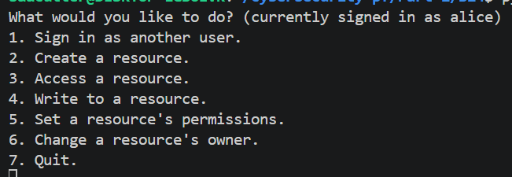
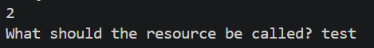
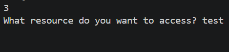
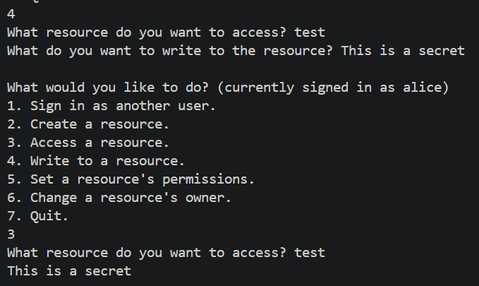
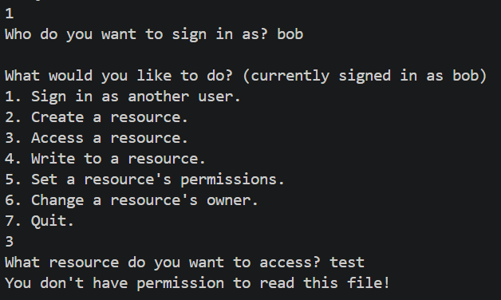
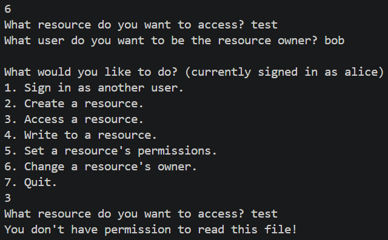
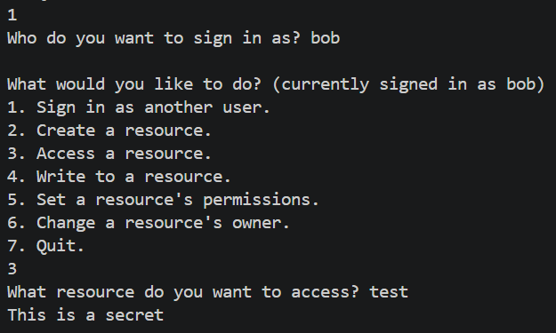
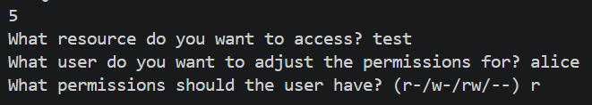
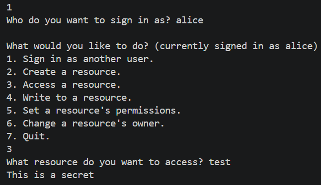
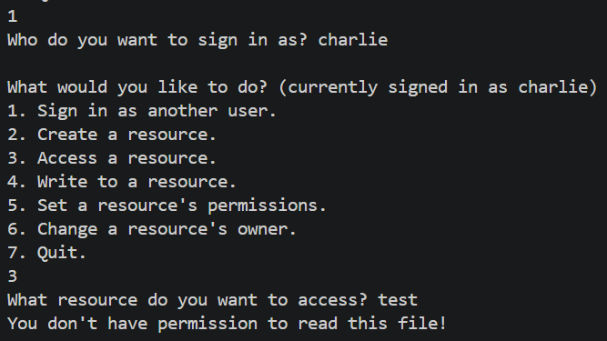

# Introduction
To complete this activity, I implemented a basic access control list using Python. This is modelled after the Windows implementation where the resource owner decides permissions, unlike the Unix-like approach which take a role-based approach to access control. Consequently, this is a discretionary access control (DAC) system.

Note that unlike traditional access-control implementations, this only stores permission information for as long as the program is running (i.e. there is no persistent storage mechanism). This means that if the program ever crashes or stops functioning for any reason, the permission associated with each file is lost (but not the files themselves). Additionally, access is only enforced using the program and is, therefore, more like a prototype rather than a complete implementation. The reason for this is because Linux (which is what was being used to run this program) already has its own access control system, and mixing them could potentially break something. While this does mean that any user outside of the program can read any resource contents, it will be assumed that the Python script running the implementation is the only way to access the files for simplicity.

## Functionality
This implementation supports a few different (basic) actions - creating a resource, reading a resource, writing to a resource, setting who can read a resource, and changing the resource's owner. By default, the program is signed into the user "alice" by default. This is just because the program needs someone signed in because users don't have usernames and passwords (though you can imagine that in a full implementation this would be required).

Creating a resource is the most basic action. This just creates an empty file and associates it with the user. This action requires the resource name to be defined by the user.

Now that the resource has been created, it can be read by the resource owner (or anyone with the correct permissions).

This resource is currently empty, so nothing was returned. This is the perfect opportunity to write some data to the file.

Now that the writing capabilities have been confirmed and the data can be read, testing that no one else can read it should be the next option. This requires another user (let's call them "bob") to be signed into and the previously created file to try and be read.

This has confirmed that the permissions to file's have been confirmed. Now that the basic functionality has all been confirmed, trying to change the resource's owner is the next action to try. To do this, the `test` resource created by Alice will be transferred to Bob.

Now that Bob owns the file, the permissions to read the file (but not write the file) can be given to Alice.

However, trying to read this resource from a third user (Charlie) still returns a permission error, as expected.

This demonstration has showcased a minimal access control implementation, showing how resource permissions can be changed and shared around to other users.