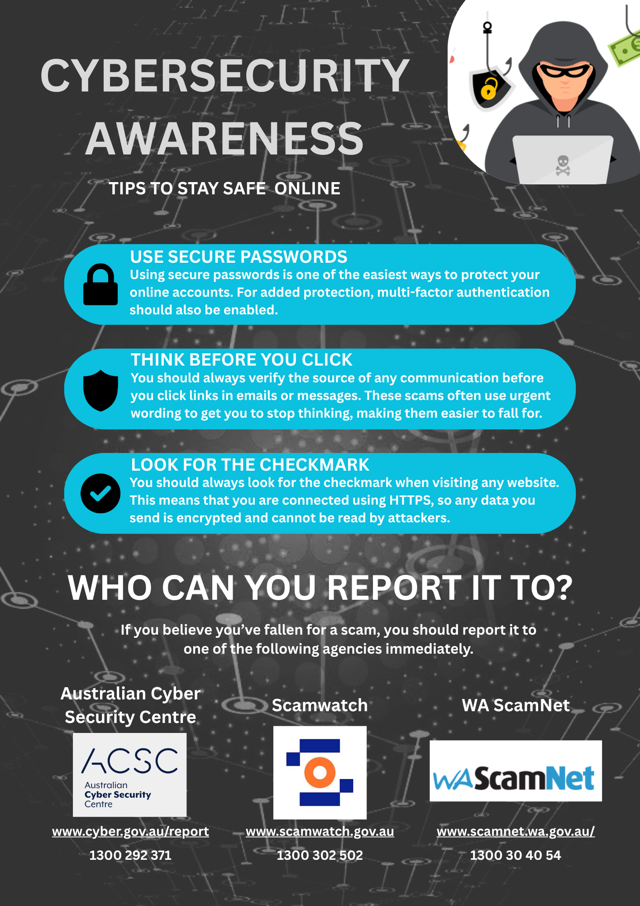

# [The Flyer](https://canva.link/nq5h2a1emeity4d)
For this activity, I created a flyer targeted toward seniors. It provides some general guidelines on staying safe online (which is information many seniors will not know), including 3 tips (using secure passwords, reading communication carefully, and ensuring that HTTPS is being used) and 3 places to report scams to (Scamwatch, ACSC, and WA ScamNet).

# References
Freedesignfile. "Virtual technology line background vector 02". Accessed: May 12, 2026. [Online]. Available: https://freedesignfile.com/510008-virtual-technology-line-background-vector-02/

Firstrust Bank. " TAKING ACTION AGAINST FRAUD & SCAMS". Accessed: May 12, 2026. [Online]. Available: https://www.firstrust.com/security-first

D. Gandy. "Padlock free icon". Accessed: May 12, 2026. [Online]. Available: https://www.flaticon.com/free-icon/padlock_25239

Freepik Company S.L.U. "Computer Security Shield free icon". Accessed: May 12, 2026. [Online]. Available: https://www.flaticon.com/free-icon/computer-security-shield_74662

meaicon. "Check free icon". Accessed: May 12, 2026. [Online]. Available: https://www.flaticon.com/free-icon/check_17767109