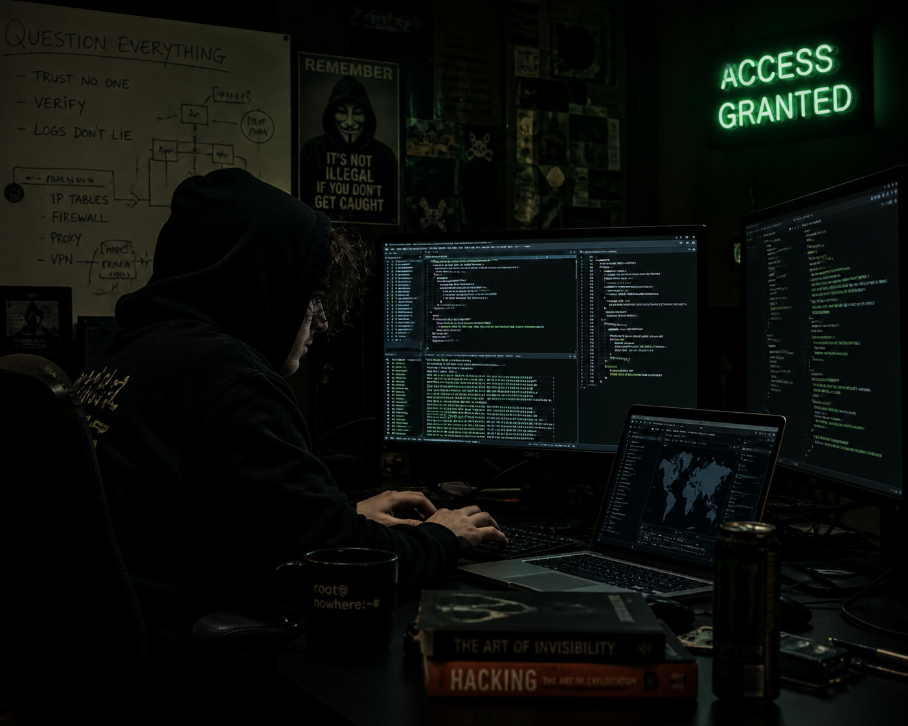
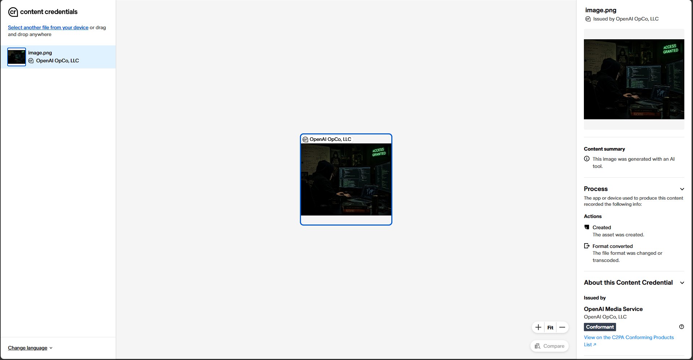
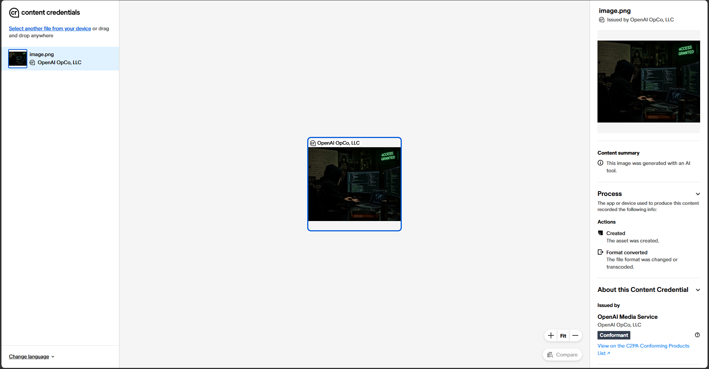
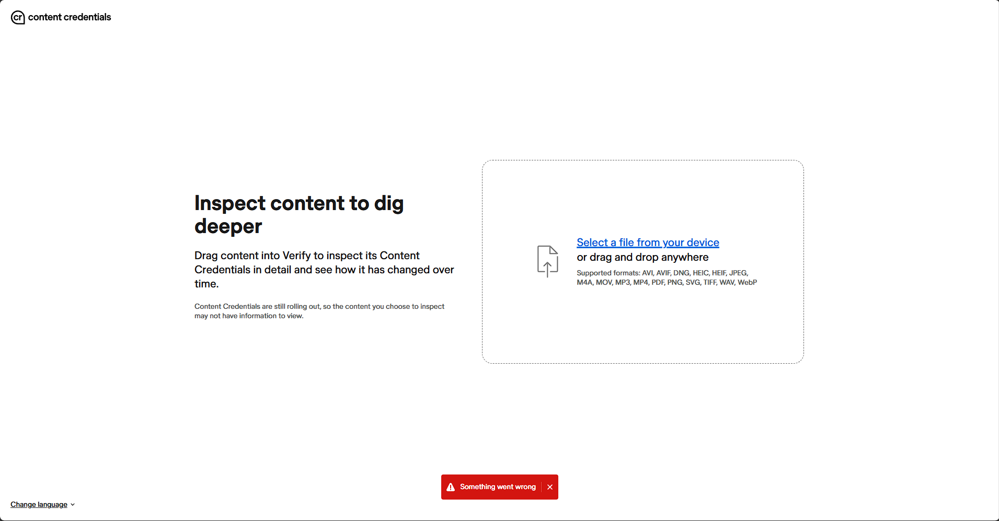

# Introduction
Before this activity could begin at all, I had to create the image. There are no constraints or limitations for this image other than it being AI generated, so this image could be anything. To fit the theme of this portfolio, the following prompt was given to ChatGPT 5.3:
> Generate me an image which showcasing what you believe a "hacker" looks like.

This resulted in the following image being generated, which will serve as the "base" image for all processes:


The full conversation is available [here](https://chatgpt.com/share/69f60423-165c-8320-8f46-5292baad4ccb).

## Steganography
After some research, a few ways to apply the watermark were identified. However, as I wanted the watermark to be able to be encoded programmatically to allow it to be easily reproduced, this reduced the options down. This led to least significant bit (or LSB) steganography to be chosen as it is the simplest method and is quicker to process. LSB steganography works by embedding data into images by flipping the last bit of each byte in the image (i.e. the least significant bit). As this is the least significant bit, the colour value of each byte will only change slightly so it is practically unnoticeable, allowing for the perfect solution to embed the watermark.

To embed the watermark, [an LSB steganography script written by Ashwin Goel](https://www.geeksforgeeks.org/profile/AshwinGoel) (with some modifications) was used. This script embeds data (i.e. the watermark) by converting each byte into an 8-bit binary string, then modifying the image data to embed these bytes before being saved. This watermark can, theoretically, be any data as long as it can be written to the image. Therefore, the watermark will be the string "CITS2006PortfolioB30".
```
def modPix(pix, data):
    datalist = [format(ord(i), '08b') for i in data]
    lendata = len(datalist)
    imdata = iter(pix)
    
    for i in range(lendata):
        pixels = [value for value in next(imdata)[:3] + next(imdata)[:3] + next(imdata)[:3]]
        
        # Modify pixel values based on binary data
        for j in range(8):
            if datalist[i][j] == '0' and pixels[j] % 2 != 0:
                pixels[j] -= 1
            elif datalist[i][j] == '1' and pixels[j] % 2 == 0:
                pixels[j] = pixels[j] - 1 if pixels[j] != 0 else pixels[j] + 1
        
        # Set termination flag (last pixel even means continue, odd means stop)
        if i == lendata - 1:
            pixels[-1] |= 1  # Make odd (stop flag)
        else:
            pixels[-1] &= ~1  # Make even (continue flag)
        
        yield tuple(pixels[:3])
        yield tuple(pixels[3:6])
        yield tuple(pixels[6:9])

def encode_enc(newimg, data):
    w = newimg.size[0]
    (x, y) = (0, 0)
    
    for pixel in modPix(newimg.getdata(), data):
        newimg.putpixel((x, y), pixel)
        x = 0 if x == w - 1 else x + 1
        y += 1 if x == 0 else 0

def encode():
    image = Image.open("base.png", 'r')
    data = "CITS2006PortfolioB30"
    
    newimg = image.copy()
    encode_enc(newimg, data)
    newimg.save("watermarked.png")
```

This script, when run on the previously generated image, created the following image.


By comparing it to the generated image, it is extremely hard to tell the difference. This is exactly why LSB steganography is used, as it makes the embedded data imperceptible to the human eye. To decode these images (or at least attempt to), the reverse process needs to be executed. This means reading the image data, looking at the pixel values, and constructing an 8-bit binary string based on these pixel values to reconstruct the original data.
```
def decode():
    image = Image.open("watermarked.png", 'r')
    imgdata = iter(image.getdata())
    data = ""
    
    while True:
        pixels = [value for value in next(imgdata)[:3] + next(imgdata)[:3] + next(imgdata)[:3]]
        binstr = ''.join(['1' if i % 2 else '0' for i in pixels[:8]])
        data += chr(int(binstr, 2))
        
        if pixels[-1] % 2 != 0:
            break
    
    return data
```
Now that there is a way to encode/decode images with data and the watermarked image has been created, the image can be edited to determine if the watermark can survive image processing.

In general, I wanted these edits to programmatically be applied so that multiple edits can be applied rapidly (but this has the additional benefit of making these images reproducible as well). Fortunately, Python has external support for image manipulation which can do exactly this through the Pillow library, an actively maintained fork of the discontinued Python Imaging Library (or PIL). This library has various functions which can apply edits to images, which can then be saved to test if the watermark can still be read. These edits were created using the following function:
```
def filter():
    image = Image.open("watermarked.png", 'r')

    image.rotate(90).save("tests/rotated90.png")
    
    image.rotate(180).save("tests/rotated180.png")

    image.transpose(Image.FLIP_LEFT_RIGHT).save("tests/hflip.png")

    image.transpose(Image.FLIP_TOP_BOTTOM).save("tests/vflip.png")

    image.resize((701, 561)).save("tests/small.png")

    image.resize((2804, 2244)).save("tests/big.png")

    ImageOps.crop(image, 1).save("tests/cropped.png")

    image.convert("L").save("tests/greyscale.png")

    image.filter(ImageFilter.BLUR).save("tests/blur.png")

    image.filter(ImageFilter.CONTOUR).save("tests/contour.png")

    image.filter(ImageFilter.EMBOSS).save("tests/emboss.png")

    image.filter(ImageFilter.FIND_EDGES).save("tests/edges.png")

    image.filter(ImageFilter.SHARPEN).save("tests/sharp.png")

    image.filter(ImageFilter.SMOOTH).save("tests/smooth.png")

    ImageOps.invert(image).save("tests/inverted.png")

    ImageEnhance.Brightness(image).enhance(1.5).save("tests/highbrightness.png")

    ImageEnhance.Brightness(image).enhance(0.5).save("tests/lowbrightness.png")

    ImageEnhance.Contrast(image).enhance(1.5).save("tests/highcontrast.png")

    ImageEnhance.Contrast(image).enhance(0.5).save("tests/lowcontrast.png")
```

In total, there are 19 edits being made. These vary from rotations, transpositions, resizes, crops, brightness adjustments, contract adjustments, and a lot more. Although this gives a good baseline of common edits, some manual processes also need to be undertaken to include some other common edits (with the additional benefit of increasing the sample size). Specifically, regenerating and compressing the image are notable editing processes that can be used to check whether the watermark can survive. Regenerating the image is very simple - all it requires is asking an LLM (in this case [ChatGPT 5.3](https://chatgpt.com/share/69f60400-02ec-8321-bc81-3f6d2fdf0dad)) if it can regenerate the image providing it as an attachment. This image was saved under `regenerated.png`. Compressing the image is also an easy process - it just required using an online tool which can compress images (in this case [Image Compressor](https://imagecompressor.com/) and setting the number of colours to 166) and downloading the result. This image was saved under `compressed.png`.

Now that all of the edited images have been created, each image can be decoded to check if the watermark remains. After checking each image individually (in no particular order), there were a few things of note.
```
Reference (watermarked.png): CITS2006PortfolioB30
            regenerated.png: ç
             compressed.png: Decoding failed.
              rotated90.png: Êw
             rotated180.png: ©ã
                  hflip.png: H
                  vflip.png: XEQ
                  small.png: ó
                    big.png: AIIJ
                cropped.png: ÂQ
              greyscale.png: Decoding failed.
                   blur.png: CITS2006PortfolioB30
                contour.png: CITS2006PortfolioB30
                 emboss.png: CITS2006PortfolioB30
                  edges.png: CITS2006PortfolioB30
                  sharp.png: CITS2006PortfolioB30
                 smooth.png: CITS2006PortfolioB30
               inverted.png: ¼
         highbrightness.png: ê
          lowbrightness.png: ©
           highcontrast.png: V÷
            lowcontrast.png: ê
```
These results indicate that, in general, the watermark did not survive the image transformations (and in fact failed for the compressed and greyscale images). There were also a few transformations where it read garbage data, likely because these changes flipped some bits.

Some of these transformations were actually successful in making the watermark survive. Specifically, the blur, contour, emboss, edges, sharp, and smooth filters still enabled the watermark to be decoded. This is likely because these filters don't interfere with the pixel data significantly, unlike the other edits. Consequently, watermarks embedded using steganography can be detected after some modifications but not all modifications.

### Metadata
As it turns out, most AI generated images have metadata associated with them. Images generated by OpenAI's image generation models (including that found in ChatGPT) embed C2PA metadata into all generated images, which is a standard created by the Coalition for Content Provenance and Authenticity (i.e. C2PA) that is embedded within media to verify its origin. However, unlike more "traditional" metadata which is typically stored as EXIF data separate from the image, C2PA data is embedded within the image data itself (and hence is more like a digital signature). Consequently, this could potentially also be used as a watermark to detect AI-generated images. To see the effect that this has when the image is edited, this metadata needs to be read. To do this, the [Content Authority Initative's verification tool](https://verify.contentauthenticity.org/) will be used.

Before any further investigation can occur, a baseline needs to be established. This will be done by running `base.png` through the verification tool to determine its origin.


As expected, the verification process has shown that the image's origin is, indeed, OpenAI. It does not say anything about the model used to generate the image, but this isn't important for this activity. Now that a baseline has been created, verifying that this watermark persists afgter regeneration is the next step. To ensure that this experiment is as fair as possible, the regenerated image from the steganography experiment will not be used - instead, another copy of `base.png` will be copied. The full conversation to perform this is available [here](https://chatgpt.com/share/69f80f34-aa4c-839c-9cc0-355989639de1), with the image saved as `regenerated.png`.


This, again, indicated that the image came from one of OpenAI's models which isn't unexpected (it was generated by OpenAI's models after all). Because this image was also generated by OpenAI's model, it is impossible to determine whether this is because the C2PA watermark survived or because it was reinserted during regeneration. To actually determine what is occurring here, a non-AI edited base image needs to be verified. This only needs to be a simple edit, so any of the edits previously made will work. For simplicity, the edit will be cropping 1 pixel off each side of the image (creating a 1400x1120 image) since this should (hopefully) reduce any noise from other edits and provide the highest chance of watermark survival. This image is provided as `cropped.png`.


After attempting to verify this image, an error was returned and the verification process couldn't continue. After some investigation, it was discovered that most editing processes are "destructive" meaning any changes are applied to the image data directly. Although there are editing processes which are non-destructive which could be used to test for watermark survival, these often use proprietary file formats which can't be read by the verification tool. This is a problem because C2PA data embeds the watermark within the image data itself, meaning that any editing process will completely erase this watermark indicating that it is extremely fragile. Because of this fragility, it becomes impossible to determine the image's origin (and hence the watermark doesn't survive image processing workflows).

# References
A. Goel. "Image based Steganography using Python". GeeksforGeeks. Accessed: May 2, 2026. [Online]. Available: https://www.geeksforgeeks.org/python/image-based-steganography-using-python/

E. Kadziolka. "How to change an image with Python". DEV. Accessed: May 2, 2026. [Online]. Available: https://dev.to/deotyma/how-to-change-an-image-with-python-518d

F. Lundh. "Image module". Accessed: May 2, 2026. [Online]. Available: https://pillow.readthedocs.io/en/stable/reference/Image.html

R. Silva. "LSB Steganography — Hiding a message in the pixels of an image". Accessed: May 3, 2026. [Online]. Available: https://medium.com/@renantkn/lsb-steganography-hiding-a-message-in-the-pixels-of-an-image-4722a8567046

OpenAI. "C2PA in ChatGPT Images". Accesssed: May 4, 2026. [Online]. Available: https://help.openai.com/en/articles/8912793-c2pa-in-chatgpt-images

Coalition for Content Provenance and Authenticity. "About Coalition for Content Provenance and Authenticity (C2PA)". Accessed: May 4, 2026. [Online]. Available: https://c2pa.org/about/

ZONER a.s. "Destructive and Non-destructive Editing". Accessed: May 4, 2026. [Online]. Available: https://help.zoner.com/article/779-destructive-and-non-destructive-editing